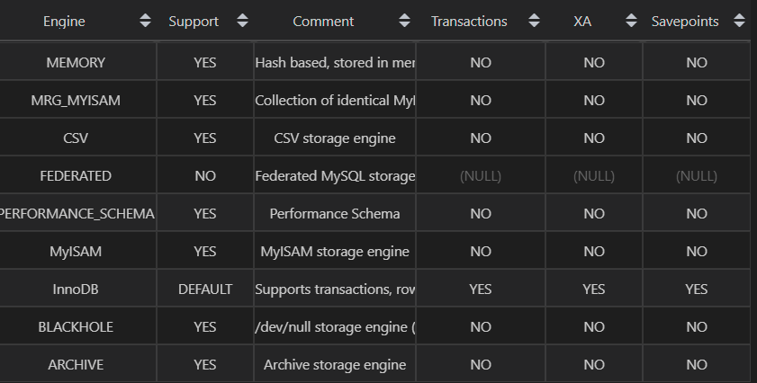
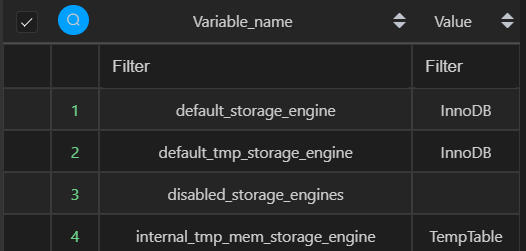
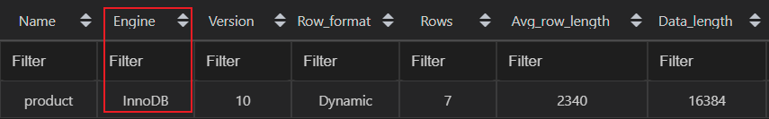
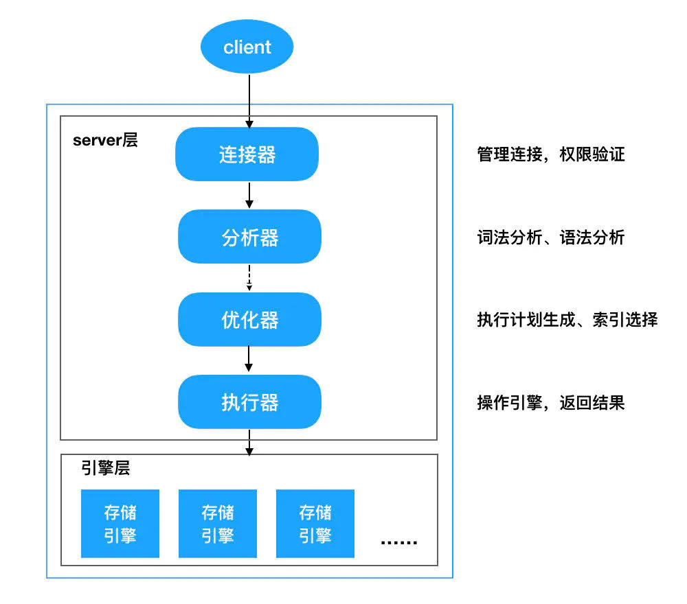

# 1. MySQL

## 1.1. 什么是MySQL?

MySQL 是一种关系型数据库，在Java企业级开发中非常常用。MySQL的默认端口号是3306。

## 1.2. 存储引擎

### 1.2.1. 查看MySQL提供的所有存储引擎

```sql
mysql> show engines;
```



MySQL 当前默认的存储引擎是InnoDB,只有 InnoDB 支持事务。

### 1.2.2. 查看MySQL当前默认的存储引擎

```sql
mysql> show variables like '%storage_engine%';
```



### 1.2.3. 查看表的存储引擎

```sql
show table status like "table_name" ;
```

 

## 1.3. MyISAM和InnoDB区别

5.5版之前, MyISAM是MySQL的默认数据库引擎。
5.5版本后, InnoDB是默认的存储引擎, 事务性数据库引擎

### 1.3.1. 两者的对比

1. 是否支持行级锁 : MyISAM 只有表级锁(table-level locking)，而InnoDB 支持行级锁(row-level locking)和表级锁,默认为行级锁。
2. 是否支持事务和崩溃后的安全恢复： MyISAM 强调的是性能，每次查询具有原子性,其执行速度比InnoDB类型更快，但是不提供事务支持。但是InnoDB 提供事务支持事务，外部键等高级数据库功能。 具有事务(commit)、回滚(rollback)和崩溃修复能力(crash recovery capabilities)的事务安全(transaction-safe (ACID compliant))型表。
3. 是否支持外键： MyISAM不支持，而InnoDB支持。
4. 是否支持MVCC ：仅 InnoDB 支持。应对高并发事务, MVCC比单纯的加锁更高效;MVCC只在 `READ COMMITTED` 和 `REPEATABLE READ` 两个隔离级别下工作;MVCC可以使用 乐观(optimistic)锁 和 悲观(pessimistic)锁来实现;各数据库中MVCC实现并不统一。

>MVCC ( Multi-Version Concurrency Control)  多版本并发控制, 一般在数据库管理系统中，实现对数据库的并发访问；在编程语言中实现事务内存。

## 1.4. 字符集及校对规则

字符集指的是一种从二进制编码到某类字符符号的映射。校对规则则是指某种字符集下的排序规则。MySQL中每一种字符集都会对应一系列的校对规则。

MySQL采用的是类似继承的方式指定字符集的默认值，每个数据库以及每张数据表都有自己的默认值，他们逐层继承。

Mysql8 默认字符集为utf8mb4

## 1.5. 索引

MySQL索引使用的数据结构主要有BTree索引 和 哈希索引 。对于哈希索引来说，底层的数据结构就是哈希表，因此在绝大多数需求为单条记录查询的时候，可以选择哈希索引，查询性能最快；其余大部分场景，建议选择BTree索引。

## 1.6. 查询缓存的使用

执行查询语句的时候，会先查询缓存。不过，MySQL 8.0 版本后移除缓存，因为这个功能不太实用

缓存虽然能够提升数据库的查询性能，但是缓存同时也带来了额外的开销，每次查询后都要做一次缓存操作，失效后还要销毁。

## 1.7. 什么是事务?

事务是逻辑上的一组操作，要么都执行，要么都不执行。

## 1.8. 事物的四大特性(ACID)


1. 原子性（Atomicity）： 事务是最小的执行单位，不允许分割。事务的原子性确保动作要么全部完成，要么完全不起作用；
2. 一致性（Consistency）： 执行事务前后，数据保持一致，多个事务对同一个数据读取的结果是相同的；
3. 隔离性（Isolation）： 并发访问数据库时，一个用户的事务不被其他事务所干扰，各并发事务之间数据库是独立的；
4. 持久性（Durability）： 一个事务被提交之后。它对数据库中数据的改变是持久的，即使数据库发生故障也不应该对其有任何影响。

## 1.9. 并发事务带来哪些问题?

在典型的应用程序中，多个事务并发运行，经常会操作相同的数据来完成各自的任务（多个用户对同一数据进行操作）。

### 1.9.1. 并发虽然是必须的，但可能会导致以下的问题

1. 脏读（Dirty read）: 当一个事务正在访问数据并且对数据进行了修改，而这种修改还没有提交到数据库中，这时另外一个事务也访问了这个数据，然后使用了这个数据。因为这个数据是还没有提交的数据，那么另外一个事务读到的这个数据是“脏数据”，依据“脏数据”所做的操作可能是不正确的。
1. 丢失修改（Lost to modify）: 指在一个事务读取一个数据时，另外一个事务也访问了该数据，那么在第一个事务中修改了这个数据后，第二个事务也修改了这个数据。这样第一个事务内的修改结果就被丢失，因此称为丢失修改。
1. 不可重复读（Unrepeatableread）: 指在一个事务内多次读同一数据。在这个事务还没有结束时，另一个事务也访问该数据。那么，在第一个事务中的两次读数据之间，由于第二个事务的修改导致第一个事务两次读取的数据可能不太一样。这就发生了在一个事务内两次读到的数据是不一样的情况，因此称为不可重复读。
1. 幻读（Phantom read）: 幻读与不可重复读类似。它发生在一个事务（T1）读取了几行数据，接着另一个并发事务（T2）插入了一些数据时。在随后的查询中，第一个事务（T1）就会发现多了一些原本不存在的记录，就好像发生了幻觉一样，所以称为幻读。

### 1.9.2. 不可重复读和幻读区别

1. 不可重复读的重点是修改, 比如多次读取一条记录发现其中某些列的值被修改
1. 幻读的重点在于新增或者删除, 比如多次读取一条记录发现记录增多或减少了

## 1.10. 事务隔离级别有哪些?

SQL 标准定义了四个隔离级别：

1. READ-UNCOMMITTED(读取未提交)： 最低的隔离级别，允许读取尚未提交的数据变更，可能会导致脏读、幻读或不可重复读。
1. READ-COMMITTED(读取已提交)： 允许读取并发事务已经提交的数据，可以阻止脏读，但是幻读或不可重复读仍有可能发生。
1. REPEATABLE-READ(可重复读)：  对同一字段的多次读取结果都是一致的，除非数据是被本身事务自己所修改，可以阻止脏读和不可重复读，但幻读仍有可能发生。
1. SERIALIZABLE(可串行化)： 最高的隔离级别，完全服从ACID的隔离级别。所有的事务依次逐个执行，这样事务之间就完全不可能产生干扰，也就是说，该级别可以防止脏读、不可重复读以及幻读。

|     隔离级别     | 脏读  | 不可重复读 | 幻读  |
| :--------------: | :---: | :--------: | :---: |
| READ-UNCOMMITTED |   √   |     √      |   √   |
|  READ-COMMITTED  |   ×   |     √      |   √   |
| REPEATABLE-READ  |   ×   |     ×      |   √   |
|   SERIALIZABLE   |   ×   |     ×      |   ×   |

## 1.11. MySQL的默认隔离级别是?

MySQL InnoDB 存储引擎的默认支持的隔离级别是 REPEATABLE-READ（可重复读）。

我们可以通过`SELECT @@tx_isolation;`命令来查看

```sql
mysql> SELECT @@tx_isolation;
+-----------------+
| @@tx_isolation  |
+-----------------+
| REPEATABLE-READ |
+-----------------+
```

InnoDB 存储引擎在 REPEATABLE-READ 事务隔离级别下使用的是Next-Key Lock 锁算法，因此可以避免幻读的产生，所以说InnoDB 存储引擎的默认支持的隔离级别是 REPEATABLE-READ（可重读） 已经可以完全保证事务的隔离性要求

InnoDB 存储引擎在 分布式事务 的情况下一般会用到 SERIALIZABLE(可串行化) 隔离级别。

## 1.12. 1 锁机制与InnoDB锁算法

### 1.12.1. MyISAM和InnoDB存储引擎使用的锁

1. MyISAM采用表级锁(table-level locking)。
1. InnoDB支持行级锁(row-level locking)和表级锁,默认为行级锁

### 1.12.2. 表级锁和行级锁对比

1. 表级锁： MySQL中锁定 粒度最大 的一种锁，对当前操作的整张表加锁，实现简单，资源消耗也比较少，加锁快，不会出现死锁。其锁定粒度最大，触发锁冲突的概率最高，并发度最低，MyISAM和 InnoDB引擎都支持表级锁。
1. 行级锁： MySQL中锁定 粒度最小 的一种锁，只针对当前操作的行进行加锁。 行级锁能大大减少数据库操作的冲突。其加锁粒度最小，并发度高，但加锁的开销也最大，加锁慢，会出现死锁。

## 1.13. 千万级大表优化

当MySQL单表记录数过大时，数据库的CRUD性能会明显下降，一些常见的优化措施如下：

### 1.13.1. 限定数据的范围

务必禁止不带任何限制数据范围条件的查询语句。
比如：我们当用户在查询订单历史的时候，我们可以控制在一个月的范围内；

### 1.13.2. 读/写分离

经典的数据库拆分方案，主库负责写，从库负责读；

### 1.13.3. 垂直拆分


垂直拆分是指数据表列的拆分，把一张列比较多的表拆分为多张表。
根据数据库里面数据表的相关性进行拆分。 例如，用户表中既有用户的登录信息又有用户的基本信息，可以将用户表拆分成两个单独的表，甚至放到单独的库做分库。

1. 垂直拆分的优点： 可以使得列数据变小，在查询时减少读取的Block数，减少I/O次数。此外，垂直分区可以简化表的结构，易于维护。
1. 垂直拆分的缺点： 主键会出现冗余，需要管理冗余列，并会引起Join操作，可以通过在应用层进行Join来解决。此外，垂直分区会让事务变得更加复杂；

>BLOCK （数据库中最小存储和处理单位）

### 1.13.4. 水平拆分


保持数据表结构不变，通过某种策略存储数据分片。这样每一片数据分散到不同的表或者库中，达到了分布式的目的。 水平拆分可以支撑非常大的数据量。

 水平拆分是指数据表行的拆分，表的行数超过200万行时，就会变慢，这时可以把一张的表的数据拆成多张表来存放。举个例子：我们可以将用户信息表拆分成多个用户信息表，这样就可以避免单一表数据量过大对性能造成影响。

水平拆分可以支持非常大的数据量。需要注意的一点是：分表仅仅是解决了单一表数据过大的问题，但由于表的数据还是在同一台机器上，其实对于提升MySQL并发能力没有什么意义，所以 水平拆分最好分库 。

水平拆分能够 支持非常大的数据量存储，应用端改造也少，但 分片事务难以解决  ，跨节点Join性能较差，逻辑复杂。 尽量不要对数据进行分片，因为拆分会带来逻辑、部署、运维的各种复杂度 ，一般的数据表在优化得当的情况下支撑千万以下的数据量是没有太大问题的。如果实在要分片，尽量选择客户端分片架构，这样可以减少一次和中间件的网络I/O。

#### 1.13.4.1. 数据库分片的两种常见方案

1. 客户端代理：  分片逻辑在应用端，封装在jar包中，通过修改或者封装JDBC层来实现。 当当网的 Sharding-JDBC 、阿里的TDDL是两种比较常用的实现。
1. 中间件代理： 在应用和数据中间加了一个代理层。分片逻辑统一维护在中间件服务中。 我们现在谈的 Mycat 、360的Atlas、网易的DDB等等都是这种架构的实现。

## 1.14. 什么是池化设计思想。什么是数据库连接池?为什么需要数据库连接池?

池化设计会初始预设资源，解决的问题就是抵消每次获取资源的消耗，如创建线程的开销，获取远程连接的开销等, 常见的如java线程池、jdbc连接池、redis连接池等就是这类设计的代表实现。

数据库连接本质就是一个 socket 的连接。数据库服务端还要维护一些缓存和用户权限信息之类的 所以占用了一些内存。我们可以把数据库连接池是看做是维护的数据库连接的缓存，以便将来需要对数据库的请求时可以重用这些连接。为每个用户打开和维护数据库连接，尤其是对动态数据库驱动的网站应用程序的请求，既昂贵又浪费资源。在连接池中，创建连接后，将其放置在池中，并再次使用它，因此不必建立新的连接。如果使用了所有连接，则会建立一个新连接并将其添加到池中。连接池还减少了用户必须等待建立与数据库的连接的时间。

## 1.15. 分库分表之后,id 主键如何处理？

分成多个表之后，每个表id都是从 1 开始累加，这样是不对的，需要一个全局唯一的 id 来支持。

生成全局 id 有下面这几种方式：

1. UUID：不适合作为主键，因为太长了，并且无序不可读，查询效率低。比较适合用于生成唯一的名字的标示比如文件的名字。
1. 数据库自增 id : 两台数据库分别设置不同步长，生成不重复ID的策略来实现高可用。这种方式生成的 id 有序，但是需要独立部署数据库实例，成本高，还会有性能瓶颈。
1. 利用 redis 生成 id : 性能比较好，灵活方便，不依赖于数据库。但是，引入了新的组件造成系统更加复杂，可用性降低，编码更加复杂，增加了系统成本。
1. Twitter的snowflake算法 ：
1. 美团的分布式ID生成系统 ：Leaf 是美团开源的分布式ID生成器，能保证全局唯一性、趋势递增、单调递增、信息安全

## 1.16. 5 一条SQL语句在MySQL中如何执行的



### 1.16.1. MySQL 主要分为 Server 层和存储引擎层

1. Server 层：主要包括连接器、查询缓存、分析器、优化器、执行器等，所有跨存储引擎的功能都在这一层实现，比如存储过程、触发器、视图，函数等，还有一个通用的日志模块 binglog 日志模块。
1. 存储引擎： 主要负责数据的存储和读取，采用可以替换的插件式架构，支持 InnoDB、MyISAM、Memory 等多个存储引擎，其中 InnoDB 引擎有自有的日志模块 redolog 模块。现在最常用的存储引擎是 InnoDB，它从 MySQL 5.5.5 版本开始就被当做默认存储引擎了。

### 1.16.2. Server层基本组件介绍

1. 连接器
    连接器主要和身份认证和权限相关的功能相关

    主要负责用户登录数据库，进行用户的身份认证，包括校验账户密码，权限等操作，如果用户账户密码已通过，连接器会到权限表中查询该用户的所有权限，之后在这个连接里的权限逻辑判断都是会依赖此时读取到的权限数据

1. 查询缓存:（8.0版本后移除）, 查询缓存主要用来缓存我们所执行的 SELECT 语句以及该语句的结果集。

1. 分析器: 分析器主要是用来分析 SQL 语句的用途，分析器也会分为几步：
    1. 词法分析，一条 SQL 语句有多个字符串组成，首先要提取关键字，比如 select，提出查询的表，提出字段名，提出查询条件等等。做完这些操作后，就会进入第二步。

    1. 语法分析，主要就是判断你输入的 sql 是否正确，是否符合 MySQL 的语法。

1. 优化器: 优化器的作用就是确定最优的执行方案，比如多个索引的时候该如何选择索引，多表查询的时候如何选择关联顺序等。

1. 执行器: 当选择了执行方案后，MySQL 就准备开始执行了，首先执行前会校验该用户有没有权限，如果没有权限，就会返回错误信息，如果有权限，就会去调用引擎的接口，返回接口执行的结果。

## 1.17. MySQL高性能优化规范建议

### 1.17.1. 数据库命令规范

1. 所有数据库对象名称必须使用小写字母并用下划线分割
1. 所有数据库对象名称禁止使用 MySQL 保留关键字（如果表名中包含关键字查询时，需要将其用单引号括起来）
1. 数据库对象的命名要能做到见名识意，并且最后不要超过 32 个字符
1. 临时库表必须以 tmp_为前缀并以日期为后缀，备份表必须以 bak_为前缀并以日期 (时间戳) 为后缀
1. 所有存储相同数据的列名和列类型必须一致（一般作为关联列，如果查询时关联列类型不一致会自动进行数据类型隐式转换，会造成列上的索引失效，导致查询效率降低）

### 1.17.2. 数据库基本设计规范

#### 1.17.2.1. 所有表必须使用 Innodb 存储引擎


Innodb 支持事务，支持行级锁，更好的恢复性，高并发下性能更好。

#### 1.17.2.2. 数据库和表的字符集统一使用 UTF8

兼容性更好，统一字符集可以避免由于字符集转换产生的乱码，不同的字符集进行比较前需要进行转换会造成索引失效，如果数据库中有存储 emoji 表情的需要，字符集需要采用 utf8mb4 字符集。

#### 1.17.2.3. 所有表和字段都需要添加注释

使用 comment 从句添加表和列的备注，从一开始就进行数据字典的维护

#### 1.17.2.4. 尽量控制单表数据量的大小,建议控制在 500 万以内

500 万并不是 MySQL 数据库的限制，过大会造成修改表结构，备份，恢复都会有很大的问题。

可以用历史数据归档（应用于日志数据），分库分表（应用于业务数据）等手段来控制数据量大小

#### 1.17.2.5. 谨慎使用 MySQL 分区表

分区表在物理上表现为多个文件，在逻辑上表现为一个表；

谨慎选择分区键，跨分区查询效率可能更低；

建议采用物理分表的方式管理大数据。

#### 1.17.2.6. 尽量做到冷热数据分离,减小表的宽度

MySQL 限制每个表最多存储 4096 列，并且每一行数据的大小不能超过 65535 字节。

减少磁盘 IO,保证热数据的内存缓存命中率（表越宽，把表装载进内存缓冲池时所占用的内存也就越大,也会消耗更多的 IO）；

更有效的利用缓存，避免读入无用的冷数据；

经常一起使用的列放到一个表中（避免更多的关联操作）。

#### 1.17.2.7. 禁止在表中建立预留字段

预留字段的命名很难做到见名识义。

预留字段无法确认存储的数据类型，所以无法选择合适的类型。

对预留字段类型的修改，会对表进行锁定。

#### 1.17.2.8. 禁止在数据库中存储图片,文件等大的二进制数据

通常文件很大，会短时间内造成数据量快速增长，数据库进行数据库读取时，通常会进行大量的随机 IO 操作，文件很大时，IO 操作很耗时。

通常存储于文件服务器，数据库只存储文件地址信息

#### 1.17.2.9. 禁止在线上做数据库压力测试

#### 1.17.2.10. 禁止从开发环境,测试环境直接连接生成环境数据库

### 1.17.3. 数据库字段设计规范

#### 1.17.3.1. 优先选择符合存储需要的最小的数据类型

列的字段越大，建立索引时所需要的空间也就越大，这样一页中所能存储的索引节点的数量也就越少也越少，在遍历时所需要的 IO 次数也就越多，索引的性能也就越差。

1. 将字符串转换成数字类型存储,如将 IP 地址转换成整形数据

    MySQL 提供了两个方法来处理 ip 地址

    •inet_aton 把 ip 转为无符号整型 (4-8 位)
    •inet_ntoa 把整型的 ip 转为地址

    插入数据前，先用 inet_aton 把 ip 地址转为整型，可以节省空间，显示数据时，使用 inet_ntoa 把整型的 ip 地址转为地址显示即可。

1. 对于非负型的数据 (如自增 ID,整型 IP) 来说,要优先使用无符号整型来存储

    无符号相对于有符号可以多出一倍的存储空间

    SIGNED INT -2147483648~2147483647
    UNSIGNED INT 0~4294967295
    VARCHAR(N) 中的 N 代表的是字符数，而不是字节数，使用 UTF8 存储 255 个汉字 Varchar(255)=765 个字节。过大的长度会消耗更多的内存。

#### 1.17.3.2. 避免使用 TEXT,BLOB 数据类型，最常见的 TEXT 类型可以存储 64k 的数据

a. 建议把 BLOB 或是 TEXT 列分离到单独的扩展表中

MySQL 内存临时表不支持 TEXT、BLOB 这样的大数据类型，如果查询中包含这样的数据，在排序等操作时，就不能使用内存临时表，必须使用磁盘临时表进行。而且对于这种数据，MySQL 还是要进行二次查询，会使 sql 性能变得很差，但是不是说一定不能使用这样的数据类型。

如果一定要使用，建议把 BLOB 或是 TEXT 列分离到单独的扩展表中，查询时一定不要使用 select * 而只需要取出必要的列，不需要 TEXT 列的数据时不要对该列进行查询。

2、TEXT 或 BLOB 类型只能使用前缀索引

因为MySQL[1] 对索引字段长度是有限制的，所以 TEXT 类型只能使用前缀索引，并且 TEXT 列上是不能有默认值的

#### 1.17.3.3. 避免使用 ENUM 类型

修改 ENUM 值需要使用 ALTER 语句

ENUM 类型的 ORDER BY 操作效率低，需要额外操作

禁止使用数值作为 ENUM 的枚举值

#### 1.17.3.4. 尽可能把所有列定义为 NOT NULL

索引 NULL 列需要额外的空间来保存，所以要占用更多的空间

进行比较和计算时要对 NULL 值做特别的处理

#### 1.17.3.5. 使用 TIMESTAMP(4 个字节) 或 DATETIME 类型 (8 个字节) 存储时间

TIMESTAMP 存储的时间范围 1970-01-01 00:00:01 ~ 2038-01-19-03:14:07

TIMESTAMP 占用 4 字节和 INT 相同，但比 INT 可读性高

超出 TIMESTAMP 取值范围的使用 DATETIME 类型存储

##### 1.17.3.5.1. 用字符串存储日期型的数据的缺点

1. 无法用日期函数进行计算和比较
1. 用字符串存储日期要占用更多的空间

#### 1.17.3.6. 同财务相关的金额类数据必须使用 decimal 类型

1. 非精准浮点：float,double
1. 精准浮点：decimal

    Decimal 类型为精准浮点数，在计算时不会丢失精度

    占用空间由定义的宽度决定，每 4 个字节可以存储 9 位数字，并且小数点要占用一个字节

    可用于存储比 bigint 更大的整型数据

### 1.17.4. 索引设计规范

#### 1.17.4.1. 限制每张表上的索引数量,建议单张表索引不超过 5 个

索引并不是越多越好！索引可以提高效率同样可以降低效率。

索引可以增加查询效率，但同样也会降低插入和更新的效率，甚至有些情况下会降低查询效率。

因为 MySQL 优化器在选择如何优化查询时，会根据统一信息，对每一个可以用到的索引来进行评估，以生成出一个最好的执行计划，如果同时有很多个索引都可以用于查询，就会增加 MySQL 优化器生成执行计划的时间，同样会降低查询性能。

#### 1.17.4.2. 禁止给表中的每一列都建立单独的索引

mysql 5.6 以后，虽然有了合并索引的优化方式，但是还是远远没有使用一个联合索引的查询方式好。

#### 1.17.4.3. 每个 Innodb 表必须有个主键

Innodb 是按照主键索引的顺序来组织表的

1. 不要使用更新频繁的列作为主键，不适用多列主键（相当于联合索引）
1. 不要使用 UUID,MD5,HASH,字符串列作为主键（无法保证数据的顺序增长）
1. 主键建议使用自增 ID 值

#### 1.17.4.4. 常见索引列建议

1. 出现在 SELECT、UPDATE、DELETE 语句的 WHERE 从句中的列
1. 包含在 ORDER BY、GROUP BY、DISTINCT 中的字段
1. 并不要将符合 1 和 2 中的字段的列都建立一个索引， 通常将 1、2 中的字段建立联合索引效果更好
1. 多表 join 的关联列

#### 1.17.4.5. 如何选择索引列的顺序

建立索引的目的是：希望通过索引进行数据查找，减少随机 IO，增加查询性能 ，索引能过滤出越少的数据，则从磁盘中读入的数据也就越少。

1. 区分度最高的放在联合索引的最左侧（区分度=列中不同值的数量/列的总行数）
1. 尽量把字段长度小的列放在联合索引的最左侧（因为字段长度越小，一页能存储的数据量越大，IO 性能也就越好）
1. 使用最频繁的列放到联合索引的左侧（这样可以比较少的建立一些索引）

#### 1.17.4.6. 避免建立冗余索引和重复索引（增加了查询优化器生成执行计划的时间）

1. 重复索引示例：primary key(id)、index(id)、unique index(id)
1. 冗余索引示例：index(a,b,c)、index(a,b)、index(a)

#### 1.17.4.7. 对于频繁的查询优先考虑使用覆盖索引

覆盖索引：就是包含了所有查询字段 (where,select,ordery by,group by 包含的字段) 的索引

##### 1.17.4.7.1. 覆盖索引的好处

1. 避免 Innodb 表进行索引的二次查询: Innodb 是以聚集索引的顺序来存储的，对于 Innodb 来说，二级索引在叶子节点中所保存的是行的主键信息，如果是用二级索引查询数据的话，在查找到相应的键值后，还要通过主键进行二次查询才能获取我们真实所需要的数据。而在覆盖索引中，二级索引的键值中可以获取所有的数据，避免了对主键的二次查询 ，减少了 IO 操作，提升了查询效率。
1. 可以把随机 IO 变成顺序 IO 加快查询效率: 由于覆盖索引是按键值的顺序存储的，对于 IO 密集型的范围查找来说，对比随机从磁盘读取每一行的数据 IO 要少的多，因此利用覆盖索引在访问时也可以把磁盘的随机读取的 IO 转变成索引查找的顺序 IO。

#### 1.17.4.8. 索引 SET 规范

尽量避免使用外键约束

•不建议使用外键约束（foreign key），但一定要在表与表之间的关联键上建立索引
•外键可用于保证数据的参照完整性，但建议在业务端实现
•外键会影响父表和子表的写操作从而降低性能

### 1.17.5. 数据库 SQL 开发规范

#### 1.17.5.1. 建议使用预编译语句进行数据库操作

预编译语句可以重复使用这些计划，减少 SQL 编译所需要的时间，还可以解决动态 SQL 所带来的 SQL 注入的问题。

只传参数，比传递 SQL 语句更高效。

相同语句可以一次解析，多次使用，提高处理效率。

#### 1.17.5.2. 避免数据类型的隐式转换

隐式转换会导致索引失效

```sql
select name,phone from customer where id = '111';
```

#### 1.17.5.3. 充分利用表上已经存在的索引

避免使用双%号的查询条件。如：a like '%123%'，（如果无前置%,只有后置%，是可以用到列上的索引的）

一个 SQL 只能利用到复合索引中的一列进行范围查询。如：有 a,b,c 列的联合索引，在查询条件中有 a 列的范围查询，则在 b,c 列上的索引将不会被用到。

在定义联合索引时，如果 a 列要用到范围查找的话，就要把 a 列放到联合索引的右侧，使用 left join 或 not exists 来优化 not in 操作，因为 not in 也通常会使用索引失效。

#### 1.17.5.4. 数据库设计时，应该要对以后扩展进行考虑

#### 1.17.5.5. 程序连接不同的数据库使用不同的账号，禁止跨库查询

1. 为数据库迁移和分库分表留出余地
1. 降低业务耦合度
1. 避免权限过大而产生的安全风险

#### 1.17.5.6. 禁止使用 SELECT * 必须使用 SELECT <字段列表> 查询

1. 消耗更多的 CPU 和 IO 以网络带宽资源
1. 无法使用覆盖索引
1. 可减少表结构变更带来的影响

#### 1.17.5.7. 禁止使用不含字段列表的 INSERT 语句

```sql
-- wrong
insert into values ('a','b','c');
-- right
insert into t(c1,c2,c3) values ('a','b','c');
```

#### 1.17.5.8. 避免使用子查询，可以把子查询优化为 join 操作

通常子查询在 in 子句中，且子查询中为简单 SQL(不包含 union、group by、order by、limit 从句) 时,才可以把子查询转化为关联查询进行优化。

##### 1.17.5.8.1. 子查询性能差的原因

子查询的结果集无法使用索引，通常子查询的结果集会被存储到临时表中，不论是内存临时表还是磁盘临时表都不会存在索引，所以查询性能会受到一定的影响。特别是对于返回结果集比较大的子查询，其对查询性能的影响也就越大。

由于子查询会产生大量的临时表也没有索引，所以会消耗过多的 CPU 和 IO 资源，产生大量的慢查询。

#### 1.17.5.9. 避免使用 JOIN 关联太多的表

对于 MySQL 来说，是存在关联缓存的，缓存的大小可以由 join_buffer_size 参数进行设置。

在 MySQL 中，对于同一个 SQL 多关联（join）一个表，就会多分配一个关联缓存，如果在一个 SQL 中关联的表越多，所占用的内存也就越大。

如果程序中大量的使用了多表关联的操作，同时 join_buffer_size 设置的也不合理的情况下，就容易造成服务器内存溢出的情况，就会影响到服务器数据库性能的稳定性。

同时对于关联操作来说，会产生临时表操作，影响查询效率，MySQL业务生产环境中建议不超过5个

#### 1.17.5.10. 减少同数据库的交互次数

数据库更适合处理批量操作，合并多个相同的操作到一起，可以提高处理效率。

#### 1.17.5.11. 对应同一列进行 or 判断时，使用 in 代替 or

in 的值不要超过 500 个，in 操作可以更有效的利用索引，or 大多数情况下很少能利用到索引。

#### 1.17.5.12. 禁止使用 order by rand() 进行随机排序

order by rand() 会把表中所有符合条件的数据装载到内存中，然后在内存中对所有数据根据随机生成的值进行排序，并且可能会对每一行都生成一个随机值，如果满足条件的数据集非常大，就会消耗大量的 CPU 和 IO 及内存资源。

推荐在程序中获取一个随机值，然后从数据库中获取数据的方式。

#### 1.17.5.13. WHERE 从句中禁止对列进行函数转换和计算

对列进行函数转换或计算时会导致无法使用索引

```sql
-- 不推荐：
where date(create_time)='20190101'
-- 推荐：
where create_time >= '20190101' and create_time < '20190102'
```

#### 1.17.5.14. 在明显不会有重复值时使用 UNION ALL 而不是 UNION

1. UNION 会把两个结果集的所有数据放到临时表中后再进行去重操作
1. UNION ALL 不会再对结果集进行去重操作

#### 1.17.5.15. 拆分复杂的大 SQL 为多个小 SQL

1. 大 SQL 逻辑上比较复杂，需要占用大量 CPU 进行计算的 SQL
1. MySQL 中，一个 SQL 只能使用一个 CPU 进行计算
1. SQL 拆分后可以通过并行执行来提高处理效率

### 1.17.6. 数据库操作行为规范

#### 1.17.6.1. 超 100 万行的批量写 (UPDATE,DELETE,INSERT) 操作,要分批多次进行操作

1. 大批量操作可能会造成严重的主从延迟

    主从环境中,大批量操作可能会造成严重的主从延迟，大批量的写操作一般都需要执行一定长的时间， 而只有当主库上执行完成后，才会在其他从库上执行，所以会造成主库与从库长时间的延迟情况

1. binlog 日志为 row 格式时会产生大量的日志

    大批量写操作会产生大量日志，特别是对于 row 格式二进制数据而言，由于在 row 格式中会记录每一行数据的修改，我们一次修改的数据越多，产生的日志量也就会越多，日志的传输和恢复所需要的时间也就越长，这也是造成主从延迟的一个原因

1. 避免产生大事务操作

    大批量修改数据，一定是在一个事务中进行的，这就会造成表中大批量数据进行锁定，从而导致大量的阻塞，阻塞会对 MySQL 的性能产生非常大的影响。

    特别是长时间的阻塞会占满所有数据库的可用连接，这会使生产环境中的其他应用无法连接到数据库，因此一定要注意大批量写操作要进行分批

#### 1.17.6.2. 对于大表使用 pt-online-schema-change 修改表结构

1. 避免大表修改产生的主从延迟
1. 避免在对表字段进行修改时进行锁表

    对大表数据结构的修改一定要谨慎，会造成严重的锁表操作，尤其是生产环境，是不能容忍的。

    pt-online-schema-change 它会首先建立一个与原表结构相同的新表，并且在新表上进行表结构的修改，然后再把原表中的数据复制到新表中，并在原表中增加一些触发器。把原表中新增的数据也复制到新表中，在行所有数据复制完成之后，把新表命名成原表，并把原来的表删除掉。把原来一个 DDL 操作，分解成多个小的批次进行。

#### 1.17.6.3. 禁止为程序使用的账号赋予 super 权限

1. 当达到最大连接数限制时，还运行 1 个有 super 权限的用户连接
1. super 权限只能留给 DBA 处理问题的账号使用

#### 1.17.6.4. 对于程序连接数据库账号,遵循权限最小原则

1. 程序使用数据库账号只能在一个 DB 下使用，不准跨库
1. 程序使用的账号原则上不准有 drop 权限

## 1.18. 7一条SQL语句执行得很慢的原因有哪些？

[腾讯面试：一条SQL语句执行得很慢的原因有哪些？---不看后悔系列](https://mp.weixin.qq.com/s?__biz=Mzg2OTA0Njk0OA==&mid=2247485185&idx=1&sn=66ef08b4ab6af5757792223a83fc0d45&chksm=cea248caf9d5c1dc72ec8a281ec16aa3ec3e8066dbb252e27362438a26c33fbe842b0e0adf47&token=79317275&lang=zh_CN#rd)

## 1.19. 9 后端程序员必备：书写高质量SQL的30条建议

[后端程序员必备：书写高质量SQL的30条建议](https://mp.weixin.qq.com/s?__biz=Mzg2OTA0Njk0OA==&mid=2247486461&idx=1&sn=60a22279196d084cc398936fe3b37772&chksm=cea24436f9d5cd20a4fa0e907590f3e700d7378b3f608d7b33bb52cfb96f503b7ccb65a1deed&token=1987003517&lang=zh_CN#rd)
