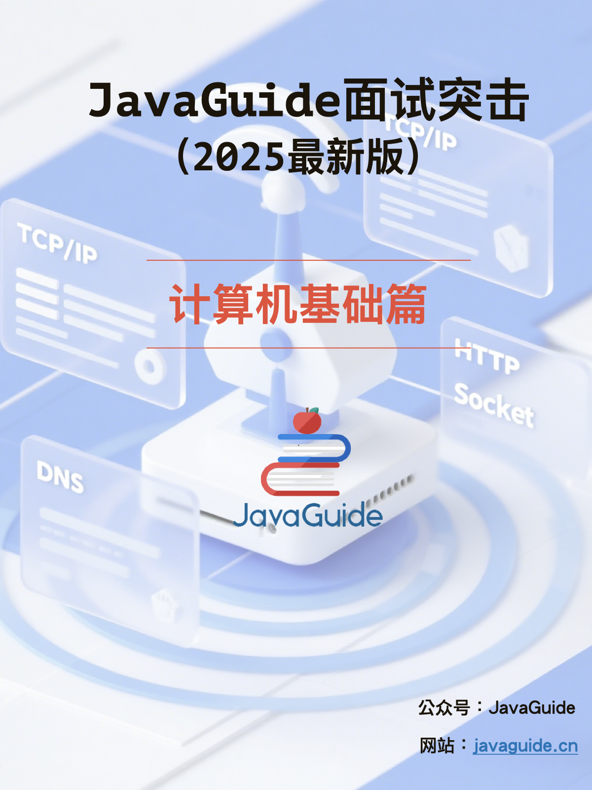

------

# 前言

由于很多读者都有突击面试的需求，所以我在几年前就弄了 **JavaGuide 面试突击版本**（JavaGuide 内容精简版，只保留重点），并持续完善跟进。对于喜欢纸质阅读的朋友来说，也可以打印出来，整体阅读体验非常高！

除了只保留最常问的面试题之外，我还进一步对重点中的重点进行了**⭐️**标注。并且，有亮色（白天）和暗色（夜间）两个主题选择，需要打印出来的朋友记得选择亮色版本。

对于时间比较充裕的朋友，我个人还是更推荐 [JavaGuide](https://javaguide.cn/) 网站系统学习，内容更全面，更深入。

JavaGuide 已经持续维护 6 年多了，累计提交了接近 **6000** commit ，共有 **570+** 多位贡献者共同参与维护和完善。用心做原创优质内容，如果觉得有帮助的话，欢迎点赞分享！传送门：[GitHub](https://github.com/Snailclimb/JavaGuide) | [Gitee](https://gitee.com/SnailClimb/JavaGuide)。

对于需要更进一步面试辅导服务的读者，欢迎加入 **[JavaGuide 官方知识星球](https://javaguide.cn/about-the-author/zhishixingqiu-two-years.html)**(技术专栏/一对一提问/简历修改/求职指南/面试打卡)，绝对物超所值！

面试突击最新版本可以在我的公众号回复“**PDF**”获取（[JavaGuide 官方知识星球](https://javaguide.cn/about-the-author/zhishixingqiu-two-years.html)会提前同步最新版，针对球友的一个小福利）。


# 计算机网络

这部分内容摘自 [JavaGuide](https://javaguide.cn/) 下面几篇文章中的重点：

- [计算机网络常见面试题总结（上）](https://javaguide.cn/cs-basics/network/other-network-questions.html)（网络分层模型、常见网路协议总结、HTTP、WebSocket、DNS 等）
- [计算机网络常见面试题总结（下）](https://javaguide.cn/cs-basics/network/other-network-questions2.html)（TCP 和 UDP、IP、ARP 等）

## 计算机网络基础

### ⭐️TCP/IP 四层模型是什么？每一层的作用是什么？

**TCP/IP 四层模型** 是目前被广泛采用的一种模型,我们可以将 TCP / IP 模型看作是 OSI 七层模型的精简版本，由以下 4 层组成：

1. 应用层
2. 传输层
3. 网络层
4. 网络接口层

需要注意的是，我们并不能将 TCP/IP 四层模型 和 OSI 七层模型完全精确地匹配起来，不过可以简单将两者对应起来，如下图所示：


关于每一层作用的详细介绍，请看 [OSI 和 TCP/IP 网络分层模型详解（基础）](https://javaguide.cn/cs-basics/network/osi-and-tcp-ip-model.html) 这篇文章。

### 为什么网络要分层？

说到分层，我们先从我们平时使用框架开发一个后台程序来说，我们往往会按照每一层做不同的事情的原则将系统分为三层（复杂的系统分层会更多）:

1. Repository（数据库操作）
2. Service（业务操作）
3. Controller（前后端数据交互）

**复杂的系统需要分层，因为每一层都需要专注于一类事情。网络分层的原因也是一样，每一层只专注于做一类事情。**

好了，再来说回：“为什么网络要分层？”。我觉得主要有 3 方面的原因：

1. **各层之间相互独立**：各层之间相互独立，各层之间不需要关心其他层是如何实现的，只需要知道自己如何调用下层提供好的功能就可以了（可以简单理解为接口调用）**。这个和我们对开发时系统进行分层是一个道理。**
2. **提高了灵活性和可替换性**：每一层都可以使用最适合的技术来实现，你只需要保证你提供的功能以及暴露的接口的规则没有改变就行了。并且，每一层都可以根据需要进行修改或替换，而不会影响到整个网络的结构。**这个和我们平时开发系统的时候要求的高内聚、低耦合的原则也是可以对应上的。**
3. **大问题化小**：分层可以将复杂的网络问题分解为许多比较小的、界线比较清晰简单的小问题来处理和解决。这样使得复杂的计算机网络系统变得易于设计，实现和标准化。 **这个和我们平时开发的时候，一般会将系统功能分解，然后将复杂的问题分解为容易理解的更小的问题是相对应的，这些较小的问题具有更好的边界（目标和接口）定义。**

我想到了计算机世界非常非常有名的一句话，这里分享一下：

> 计算机科学领域的任何问题都可以通过增加一个间接的中间层来解决，计算机整个体系从上到下都是按照严格的层次结构设计的。

### 应用层有哪些常见的协议？


- **HTTP（Hypertext Transfer Protocol，超文本传输协议）**：基于 TCP 协议，是一种用于传输超文本和多媒体内容的协议，主要是为 Web 浏览器与 Web 服务器之间的通信而设计的。当我们使用浏览器浏览网页的时候，我们网页就是通过 HTTP 请求进行加载的。
- **SMTP（Simple Mail Transfer Protocol，简单邮件发送协议）**：基于 TCP 协议，是一种用于发送电子邮件的协议。注意 ⚠️：SMTP 协议只负责邮件的发送，而不是接收。要从邮件服务器接收邮件，需要使用 POP3 或 IMAP 协议。
- **POP3/IMAP（邮件接收协议）**：基于 TCP 协议，两者都是负责邮件接收的协议。IMAP 协议是比 POP3 更新的协议，它在功能和性能上都更加强大。IMAP 支持邮件搜索、标记、分类、归档等高级功能，而且可以在多个设备之间同步邮件状态。几乎所有现代电子邮件客户端和服务器都支持 IMAP。
- **FTP（File Transfer Protocol，文件传输协议）** : 基于 TCP 协议，是一种用于在计算机之间传输文件的协议，可以屏蔽操作系统和文件存储方式。注意 ⚠️：FTP 是一种不安全的协议，因为它在传输过程中不会对数据进行加密。建议在传输敏感数据时使用更安全的协议，如 SFTP。
- **Telnet（远程登陆协议）**：基于 TCP 协议，用于通过一个终端登陆到其他服务器。Telnet 协议的最大缺点之一是所有数据（包括用户名和密码）均以明文形式发送，这有潜在的安全风险。这就是为什么如今很少使用 Telnet，而是使用一种称为 SSH 的非常安全的网络传输协议的主要原因。
- **SSH（Secure Shell Protocol，安全的网络传输协议）**：基于 TCP 协议，通过加密和认证机制实现安全的访问和文件传输等业务
- **RTP（Real-time Transport Protocol，实时传输协议）**：通常基于 UDP 协议，但也支持 TCP 协议。它提供了端到端的实时传输数据的功能，但不包含资源预留存、不保证实时传输质量，这些功能由 WebRTC 实现。
- **DNS（Domain Name System，域名管理系统）**: 基于 UDP 协议，用于解决域名和 IP 地址的映射问题。

关于这些协议的详细介绍请看 [应用层常见协议总结（应用层）](https://javaguide.cn/cs-basics/network/application-layer-protocol.html) 这篇文章。

## HTTP

### ⭐️从输入 URL 到页面展示到底发生了什么？（非常重要）

> 类似的问题：打开一个网页，整个过程会使用哪些协议？

先来看一张图（来源于《图解 HTTP》）：


上图有一个错误需要注意：是 OSPF 不是 OPSF。 OSPF（Open Shortest Path First，ospf）开放最短路径优先协议, 是由 Internet 工程任务组开发的路由选择协议

总体来说分为以下几个步骤:

1. 在浏览器中输入指定网页的 URL。
2. 浏览器通过 DNS 协议，获取域名对应的 IP 地址。
3. 浏览器根据 IP 地址和端口号，向目标服务器发起一个 TCP 连接请求。
4. 浏览器在 TCP 连接上，向服务器发送一个 HTTP 请求报文，请求获取网页的内容。
5. 服务器收到 HTTP 请求报文后，处理请求，并返回 HTTP 响应报文给浏览器。
6. 浏览器收到 HTTP 响应报文后，解析响应体中的 HTML 代码，渲染网页的结构和样式，同时根据 HTML 中的其他资源的 URL（如图片、CSS、JS 等），再次发起 HTTP 请求，获取这些资源的内容，直到网页完全加载显示。
7. 浏览器在不需要和服务器通信时，可以主动关闭 TCP 连接，或者等待服务器的关闭请求。

详细介绍可以查看这篇文章：[访问网页的全过程（知识串联）](https://javaguide.cn/cs-basics/network/the-whole-process-of-accessing-web-pages.html)（强烈推荐）。

### ⭐️HTTP 状态码有哪些？

HTTP 状态码用于描述 HTTP 请求的结果，比如 2xx 就代表请求被成功处理。


关于 HTTP 状态码更详细的总结，可以看我写的这篇文章：[HTTP 常见状态码总结（应用层）](https://javaguide.cn/cs-basics/network/http-status-codes.html)。

### ⭐️HTTP 和 HTTPS 有什么区别？（重要）


- **端口号**：HTTP 默认是 80，HTTPS 默认是 443。
- **URL 前缀**：HTTP 的 URL 前缀是 `http://`，HTTPS 的 URL 前缀是 `https://`。
- **安全性和资源消耗**：HTTP 协议运行在 TCP 之上，所有传输的内容都是明文，客户端和服务器端都无法验证对方的身份。HTTPS 是运行在 SSL/TLS 之上的 HTTP 协议，SSL/TLS 运行在 TCP 之上。所有传输的内容都经过加密，加密采用对称加密，但对称加密的密钥用服务器方的证书进行了非对称加密。所以说，HTTP 安全性没有 HTTPS 高，但是 HTTPS 比 HTTP 耗费更多服务器资源。
- **SEO（搜索引擎优化）**：搜索引擎通常会更青睐使用 HTTPS 协议的网站，因为 HTTPS 能够提供更高的安全性和用户隐私保护。使用 HTTPS 协议的网站在搜索结果中可能会被优先显示，从而对 SEO 产生影响。

关于 HTTP 和 HTTPS 更详细的对比总结，可以看我写的这篇文章：[HTTP vs HTTPS（应用层）](https://javaguide.cn/cs-basics/network/http-vs-https.html) 。

### HTTP/1.0 和 HTTP/1.1 有什么区别？


- **连接方式** : HTTP/1.0 为短连接，HTTP/1.1 支持长连接。HTTP 协议的长连接和短连接，实质上是 TCP 协议的长连接和短连接。
- **状态响应码** : HTTP/1.1 中新加入了大量的状态码，光是错误响应状态码就新增了 24 种。比如说，`100 (Continue)`——在请求大资源前的预热请求，`206 (Partial Content)`——范围请求的标识码，`409 (Conflict)`——请求与当前资源的规定冲突，`410 (Gone)`——资源已被永久转移，而且没有任何已知的转发地址。
- **缓存机制** : 在 HTTP/1.0 中主要使用 Header 里的 If-Modified-Since,Expires 来做为缓存判断的标准，HTTP/1.1 则引入了更多的缓存控制策略例如 Entity tag，If-Unmodified-Since, If-Match, If-None-Match 等更多可供选择的缓存头来控制缓存策略。
- **带宽**：HTTP/1.0 中，存在一些浪费带宽的现象，例如客户端只是需要某个对象的一部分，而服务器却将整个对象送过来了，并且不支持断点续传功能，HTTP/1.1 则在请求头引入了 range 头域，它允许只请求资源的某个部分，即返回码是 206（Partial Content），这样就方便了开发者自由的选择以便于充分利用带宽和连接。
- **Host 头（Host Header）处理** :HTTP/1.1 引入了 Host 头字段，允许在同一 IP 地址上托管多个域名，从而支持虚拟主机的功能。而 HTTP/1.0 没有 Host 头字段，无法实现虚拟主机。

关于 HTTP/1.0 和 HTTP/1.1 更详细的对比总结，可以看我写的这篇文章：[HTTP/1.0 vs HTTP/1.1（应用层）](https://javaguide.cn/cs-basics/network/http1.0-vs-http1.1.html) 。

### ⭐️HTTP/1.1 和 HTTP/2.0 有什么区别？


- **多路复用（Multiplexing）**：HTTP/2.0 在同一连接上可以同时传输多个请求和响应（可以看作是 HTTP/1.1 中长链接的升级版本），互不干扰。HTTP/1.1 则使用串行方式，每个请求和响应都需要独立的连接，而浏览器为了控制资源会有 6-8 个 TCP 连接的限制。这使得 HTTP/2.0 在处理多个请求时更加高效，减少了网络延迟和提高了性能。
- **二进制帧（Binary Frames）**：HTTP/2.0 使用二进制帧进行数据传输，而 HTTP/1.1 则使用文本格式的报文。二进制帧更加紧凑和高效，减少了传输的数据量和带宽消耗。
- **队头阻塞**：HTTP/2 引入了多路复用技术，允许多个请求和响应在单个 TCP 连接上并行交错传输，解决了 HTTP/1.1 应用层的队头阻塞问题，但 HTTP/2 依然受到 TCP 层队头阻塞 的影响。
- **头部压缩（Header Compression）**：HTTP/1.1 支持`Body`压缩，`Header`不支持压缩。HTTP/2.0 支持对`Header`压缩，使用了专门为`Header`压缩而设计的 HPACK 算法，减少了网络开销。
- **服务器推送（Server Push）**：HTTP/2.0 支持服务器推送，可以在客户端请求一个资源时，将其他相关资源一并推送给客户端，从而减少了客户端的请求次数和延迟。而 HTTP/1.1 需要客户端自己发送请求来获取相关资源。

HTTP/2.0 多路复用效果图（图源： [HTTP/2 For Web Developers](https://blog.cloudflare.com/http-2-for-web-developers/)）：


可以看到，HTTP/2 的多路复用机制允许多个请求和响应共享一个 TCP 连接，从而避免了 HTTP/1.1 在应对并发请求时需要建立多个并行连接的情况，减少了重复连接建立和维护的额外开销。而在 HTTP/1.1 中，尽管支持持久连接，但为了缓解队头阻塞问题，浏览器通常会为同一域名建立多个并行连接。

### HTTP/2.0 和 HTTP/3.0 有什么区别？


- **传输协议**：HTTP/2.0 是基于 TCP 协议实现的，HTTP/3.0 新增了 QUIC（Quick UDP Internet Connections） 协议来实现可靠的传输，提供与 TLS/SSL 相当的安全性，具有较低的连接和传输延迟。你可以将 QUIC 看作是 UDP 的升级版本，在其基础上新增了很多功能比如加密、重传等等。HTTP/3.0 之前名为 HTTP-over-QUIC，从这个名字中我们也可以发现，HTTP/3 最大的改造就是使用了 QUIC。
- **连接建立**：HTTP/2.0 需要经过经典的 TCP 三次握手过程（由于安全的 HTTPS 连接建立还需要 TLS 握手，共需要大约 3 个 RTT）。由于 QUIC 协议的特性（TLS 1.3，TLS 1.3 除了支持 1 个 RTT 的握手，还支持 0 个 RTT 的握手）连接建立仅需 0-RTT 或者 1-RTT。这意味着 QUIC 在最佳情况下不需要任何的额外往返时间就可以建立新连接。
- **头部压缩**：HTTP/2.0 使用 HPACK 算法进行头部压缩，而 HTTP/3.0 使用更高效的 QPACK 头压缩算法。
- **队头阻塞**：HTTP/2.0 多请求复用一个 TCP 连接，一旦发生丢包，就会阻塞住所有的 HTTP 请求。由于 QUIC 协议的特性，HTTP/3.0 在一定程度上解决了队头阻塞（Head-of-Line blocking, 简写：HOL blocking）问题，一个连接建立多个不同的数据流，这些数据流之间独立互不影响，某个数据流发生丢包了，其数据流不受影响（本质上是多路复用+轮询）。
- **连接迁移**：HTTP/3.0 支持连接迁移，因为 QUIC 使用 64 位 ID 标识连接，只要 ID 不变就不会中断，网络环境改变时（如从 Wi-Fi 切换到移动数据）也能保持连接。而 TCP 连接是由（源 IP，源端口，目的 IP，目的端口）组成，这个四元组中一旦有一项值发生改变，这个连接也就不能用了。
- **错误恢复**：HTTP/3.0 具有更好的错误恢复机制，当出现丢包、延迟等网络问题时，可以更快地进行恢复和重传。而 HTTP/2.0 则需要依赖于 TCP 的错误恢复机制。
- **安全性**：在 HTTP/2.0 中，TLS 用于加密和认证整个 HTTP 会话，包括所有的 HTTP 头部和数据负载。TLS 的工作是在 TCP 层之上，它加密的是在 TCP 连接中传输的应用层的数据，并不会对 TCP 头部以及 TLS 记录层头部进行加密，所以在传输的过程中 TCP 头部可能会被攻击者篡改来干扰通信。而 HTTP/3.0 的 QUIC 对整个数据包（包括报文头和报文体）进行了加密与认证处理，保障安全性。

HTTP/1.0、HTTP/2.0 和 HTTP/3.0 的协议栈比较：


下图是一个更详细的 HTTP/2.0 和 HTTP/3.0 对比图：


从上图可以看出：

- **HTTP/2.0**：使用 TCP 作为传输协议、使用 HPACK 进行头部压缩、依赖 TLS 进行加密。
- **HTTP/3.0**：使用基于 UDP 的 QUIC 协议、使用更高效的 QPACK 进行头部压缩、在 QUIC 中直接集成了 TLS。QUIC 协议具备连接迁移、拥塞控制与避免、流量控制等特性。

关于 HTTP/1.0 -> HTTP/3.0 更详细的演进介绍，推荐阅读 [HTTP1 到 HTTP3 的工程优化](https://dbwu.tech/posts/http_evolution/)。

### HTTP/1.1 和 HTTP/2.0 的队头阻塞有什么不同？

HTTP/1.1 队头阻塞的主要原因是无法多路复用：

- 在一个 TCP 连接中，资源的请求和响应是按顺序处理的。如果一个大的资源（如一个大文件）正在传输，后续的小资源（如较小的 CSS 文件）需要等待前面的资源传输完成后才能被发送。
- 如果浏览器需要同时加载多个资源（如多个 CSS、JS 文件等），它通常会开启多个并行的 TCP 连接（一般限制为 6 个）。但每个连接仍然受限于顺序的请求-响应机制，因此仍然会发生 **应用层的队头阻塞**。

虽然 HTTP/2.0 引入了多路复用技术，允许多个请求和响应在单个 TCP 连接上并行交错传输，解决了 **HTTP/1.1 应用层的队头阻塞问题**，但 HTTP/2.0 依然受到 **TCP 层队头阻塞** 的影响：

- HTTP/2.0 通过帧（frame）机制将每个资源分割成小块，并为每个资源分配唯一的流 ID，这样多个资源的数据可以在同一 TCP 连接中交错传输。
- TCP 作为传输层协议，要求数据按顺序交付。如果某个数据包在传输过程中丢失，即使后续的数据包已经到达，也必须等待丢失的数据包重传后才能继续处理。这种传输层的顺序性导致了 **TCP 层的队头阻塞**。
- 举例来说，如果 HTTP/2 的一个 TCP 数据包中携带了多个资源的数据（例如 JS 和 CSS），而该数据包丢失了，那么后续数据包中的所有资源数据都需要等待丢失的数据包重传回来，导致所有流（streams）都被阻塞。

最后，来一张表格总结补充一下：

| **方面**       | **HTTP/1.1 的队头阻塞**                  | **HTTP/2.0 的队头阻塞**                                      |
| -------------- | ---------------------------------------- | ------------------------------------------------------------ |
| **层级**       | 应用层（HTTP 协议本身的限制）            | 传输层（TCP 协议的限制）                                     |
| **根本原因**   | 无法多路复用，请求和响应必须按顺序传输   | TCP 要求数据包按顺序交付，丢包时阻塞整个连接                 |
| **受影响范围** | 单个 HTTP 请求/响应会阻塞后续请求/响应。 | 单个 TCP 包丢失会影响所有 HTTP/2.0 流(依赖于同一个底层 TCP 连接) |
| **缓解方法**   | 开启多个并行的 TCP 连接                  | 减少网络掉包或者使用基于 UDP 的 QUIC 协议                    |
| **影响场景**   | 每次都会发生，尤其是大文件阻塞小文件时。 | 丢包率较高的网络环境下更容易发生。                           |

### ⭐️HTTP 是不保存状态的协议, 如何保存用户状态?

HTTP 协议本身是 **无状态的 (stateless)** 。这意味着服务器默认情况下无法区分两个连续的请求是否来自同一个用户，或者同一个用户之前的操作是什么。这就像一个“健忘”的服务员，每次你跟他说话，他都不知道你是谁，也不知道你之前点过什么菜。

但在实际的 Web 应用中，比如网上购物、用户登录等场景，我们显然需要记住用户的状态（例如购物车里的商品、用户的登录信息）。为了解决这个问题，主要有以下几种常用机制：

**方案一：Session (会话) 配合 Cookie (主流方式)：**


这可以说是最经典也是最常用的方法了。基本流程是这样的：

1. 用户向服务器发送用户名、密码、验证码用于登陆系统。
2. 服务器验证通过后，会为这个用户创建一个专属的 Session 对象（可以理解为服务器上的一块内存，存放该用户的状态数据，如购物车、登录信息等）存储起来，并给这个 Session 分配一个唯一的 `SessionID`。
3. 服务器通过 HTTP 响应头中的 `Set-Cookie` 指令，把这个 `SessionID` 发送给用户的浏览器。
4. 浏览器接收到 `SessionID` 后，会将其以 Cookie 的形式保存在本地。当用户保持登录状态时，每次向该服务器发请求，浏览器都会自动带上这个存有 `SessionID` 的 Cookie。
5. 服务器收到请求后，从 Cookie 中拿出 `SessionID`，就能找到之前保存的那个 Session 对象，从而知道这是哪个用户以及他之前的状态了。

使用 Session 的时候需要注意下面几个点：

- **客户端 Cookie 支持**：依赖 Session 的核心功能要确保用户浏览器开启了 Cookie。
- **Session 过期管理**：合理设置 Session 的过期时间，平衡安全性和用户体验。
- **Session ID 安全**：为包含 `SessionID` 的 Cookie 设置 `HttpOnly` 标志可以防止客户端脚本（如 JavaScript）窃取，设置 Secure 标志可以保证 `SessionID` 只在 HTTPS 连接下传输，增加安全性。

Session 数据本身存储在服务器端。常见的存储方式有：

- **服务器内存**:实现简单，访问速度快，但服务器重启数据会丢失，且不利于多服务器间的负载均衡。这种方式适合简单且用户量不大的业务场景。
- **数据库 (如 MySQL, PostgreSQL)**:数据持久化，但读写性能相对较低，一般不会使用这种方式。
- **分布式缓存 (如 Redis)**:性能高，支持分布式部署，是目前大规模应用中非常主流的方案。

**方案二：当 Cookie 被禁用时：URL 重写 (URL Rewriting)**

如果用户的浏览器禁用了 Cookie，或者某些情况下不便使用 Cookie，还有一种备选方案是 URL 重写。这种方式会将 `SessionID` 直接附加到 URL 的末尾，作为参数传递。例如：<http://www.example.com/page?sessionid=xxxxxx>。服务器端会解析 URL 中的 `sessionid` 参数来获取 `SessionID`，进而找到对应的 Session 数据。

这种方法一般不会使用，存在以下缺点：

- URL 会变长且不美观；
- `SessionID` 暴露在 URL 中，安全性较低（容易被复制、分享或记录在日志中）；
- 对搜索引擎优化 (SEO) 可能不友好。

**方案三：Token-based 认证 (如 JWT - JSON Web Tokens)**

这是一种越来越流行的无状态认证方式，尤其适用于前后端分离的架构和微服务。


以 JWT 为例（普通 Token 方案也可以），简化后的步骤如下

1. 用户向服务器发送用户名、密码以及验证码用于登陆系统；
2. 如果用户用户名、密码以及验证码校验正确的话，服务端会返回已经签名的 Token，也就是 JWT；
3. 客户端收到 Token 后自己保存起来（比如浏览器的 `localStorage` ）；
4. 用户以后每次向后端发请求都在 Header 中带上这个 JWT ；
5. 服务端检查 JWT 并从中获取用户相关信息。

JWT 详细介绍可以查看这两篇文章：

- [JWT 基础概念详解](https://javaguide.cn/system-design/security/jwt-intro.html)
- [JWT 身份认证优缺点分析](https://javaguide.cn/system-design/security/advantages-and-disadvantages-of-jwt.html)

总结来说，虽然 HTTP 本身是无状态的，但通过 Cookie + Session、URL 重写或 Token 等机制，我们能够有效地在 Web 应用中跟踪和管理用户状态。其中，**Cookie + Session 是最传统也最广泛使用的方式，而 Token-based 认证则在现代 Web 应用中越来越受欢迎。**

### URI 和 URL 的区别是什么?

- URI(Uniform Resource Identifier) 是统一资源标志符，可以唯一标识一个资源。
- URL(Uniform Resource Locator) 是统一资源定位符，可以提供该资源的路径。它是一种具体的 URI，即 URL 可以用来标识一个资源，而且还指明了如何 locate 这个资源。

URI 的作用像身份证号一样，URL 的作用更像家庭住址一样。URL 是一种具体的 URI，它不仅唯一标识资源，而且还提供了定位该资源的信息。

### Cookie 和 Session 有什么区别？

准确点来说，这个问题属于认证授权的范畴，你可以在 [认证授权基础概念详解](https://javaguide.cn/system-design/security/basis-of-authority-certification.html) 这篇文章中找到详细的答案。

### ⭐️GET 和 POST 的区别

这个问题在知乎上被讨论的挺火热的，地址：<https://www.zhihu.com/question/28586791> 。


GET 和 POST 是 HTTP 协议中两种常用的请求方法，它们在不同的场景和目的下有不同的特点和用法。一般来说，可以从以下几个方面来区分二者（重点搞清两者在语义上的区别即可）：

- 语义（主要区别）：GET 通常用于获取或查询资源，而 POST 通常用于创建或修改资源。
- 幂等：GET 请求是幂等的，即多次重复执行不会改变资源的状态，而 POST 请求是不幂等的，即每次执行可能会产生不同的结果或影响资源的状态。
- 格式：GET 请求的参数通常放在 URL 中，形成查询字符串（querystring），而 POST 请求的参数通常放在请求体（body）中，可以有多种编码格式，如 application/x-www-form-urlencoded、multipart/form-data、application/json 等。GET 请求的 URL 长度受到浏览器和服务器的限制，而 POST 请求的 body 大小则没有明确的限制。不过，实际上 GET 请求也可以用 body 传输数据，只是并不推荐这样做，因为这样可能会导致一些兼容性或者语义上的问题。
- 缓存：由于 GET 请求是幂等的，它可以被浏览器或其他中间节点（如代理、网关）缓存起来，以提高性能和效率。而 POST 请求则不适合被缓存，因为它可能有副作用，每次执行可能需要实时的响应。
- 安全性：GET 请求和 POST 请求如果使用 HTTP 协议的话，那都不安全，因为 HTTP 协议本身是明文传输的，必须使用 HTTPS 协议来加密传输数据。另外，GET 请求相比 POST 请求更容易泄露敏感数据，因为 GET 请求的参数通常放在 URL 中。

再次提示，重点搞清两者在语义上的区别即可，实际使用过程中，也是通过语义来区分使用 GET 还是 POST。不过，也有一些项目所有的请求都用 POST，这个并不是固定的，项目组达成共识即可。

## WebSocket

### 什么是 WebSocket?

WebSocket 是一种基于 TCP 连接的全双工通信协议，即客户端和服务器可以同时发送和接收数据。

WebSocket 协议在 2008 年诞生，2011 年成为国际标准，几乎所有主流较新版本的浏览器都支持该协议。不过，WebSocket 不只能在基于浏览器的应用程序中使用，很多编程语言、框架和服务器都提供了 WebSocket 支持。

WebSocket 协议本质上是应用层的协议，用于弥补 HTTP 协议在持久通信能力上的不足。客户端和服务器仅需一次握手，两者之间就直接可以创建持久性的连接，并进行双向数据传输。


下面是 WebSocket 的常见应用场景：

- 视频弹幕
- 实时消息推送，详见[Web 实时消息推送详解](https://javaguide.cn/system-design/web-real-time-message-push.html)这篇文章
- 实时游戏对战
- 多用户协同编辑
- 社交聊天
- ……

### ⭐️WebSocket 和 HTTP 有什么区别？

WebSocket 和 HTTP 两者都是基于 TCP 的应用层协议，都可以在网络中传输数据。

下面是二者的主要区别：

- WebSocket 是一种双向实时通信协议，而 HTTP 是一种单向通信协议。并且，HTTP 协议下的通信只能由客户端发起，服务器无法主动通知客户端。
- WebSocket 使用 ws:// 或 wss://（使用 SSL/TLS 加密后的协议，类似于 HTTP 和 HTTPS 的关系） 作为协议前缀，HTTP 使用 http:// 或 https:// 作为协议前缀。
- WebSocket 可以支持扩展，用户可以扩展协议，实现部分自定义的子协议，如支持压缩、加密等。
- WebSocket 通信数据格式比较轻量，用于协议控制的数据包头部相对较小，网络开销小，而 HTTP 通信每次都要携带完整的头部，网络开销较大（HTTP/2.0 使用二进制帧进行数据传输，还支持头部压缩，减少了网络开销）。

### WebSocket 的工作过程是什么样的？

WebSocket 的工作过程可以分为以下几个步骤：

1. 客户端向服务器发送一个 HTTP 请求，请求头中包含 `Upgrade: websocket` 和 `Sec-WebSocket-Key` 等字段，表示要求升级协议为 WebSocket；
2. 服务器收到这个请求后，会进行升级协议的操作，如果支持 WebSocket，它将回复一个 HTTP 101 状态码，响应头中包含 ，`Connection: Upgrade`和 `Sec-WebSocket-Accept: xxx` 等字段、表示成功升级到 WebSocket 协议。
3. 客户端和服务器之间建立了一个 WebSocket 连接，可以进行双向的数据传输。数据以帧（frames）的形式进行传送，WebSocket 的每条消息可能会被切分成多个数据帧（最小单位）。发送端会将消息切割成多个帧发送给接收端，接收端接收消息帧，并将关联的帧重新组装成完整的消息。
4. 客户端或服务器可以主动发送一个关闭帧，表示要断开连接。另一方收到后，也会回复一个关闭帧，然后双方关闭 TCP 连接。

另外，建立 WebSocket 连接之后，通过心跳机制来保持 WebSocket 连接的稳定性和活跃性。

### ⭐️WebSocket 与短轮询、长轮询的区别

这三种方式，都是为了解决“**客户端如何及时获取服务器最新数据，实现实时更新**”的问题。它们的实现方式和效率、实时性差异较大。

**1.短轮询（Short Polling）**

- **原理**：客户端每隔固定时间（如 5 秒）发起一次 HTTP 请求，询问服务器是否有新数据。服务器收到请求后立即响应。
- **优点**：实现简单，兼容性好，直接用常规 HTTP 请求即可。
- **缺点**：
  - **实时性一般**：消息可能在两次轮询间到达，用户需等到下次请求才知晓。
  - **资源浪费大**：反复建立/关闭连接，且大多数请求收到的都是“无新消息”，极大增加服务器和网络压力。

**2.长轮询（Long Polling）**

- **原理**：客户端发起请求后，若服务器暂时无新数据，则会保持连接，直到有新数据或超时才响应。客户端收到响应后立即发起下一次请求，实现“伪实时”。
- **优点**：
  - **实时性较好**：一旦有新数据可立即推送，无需等待下次定时请求。
  - **空响应减少**：减少了无效的空响应，提升了效率。
- **缺点**：
  - **服务器资源占用高**：需长时间维护大量连接，消耗服务器线程/连接数。
  - **资源浪费大**：每次响应后仍需重新建立连接，且依然基于 HTTP 单向请求-响应机制。

**3. WebSocket**

- **原理**：客户端与服务器通过一次 HTTP Upgrade 握手后，建立一条持久的 TCP 连接。之后，双方可以随时、主动地发送数据，实现真正的全双工、低延迟通信。
- **优点**：
  - **实时性强**：数据可即时双向收发，延迟极低。
  - **资源效率高**：连接持续，无需反复建立/关闭，减少资源消耗。
  - **功能强大**：支持服务端主动推送消息、客户端主动发起通信。
- **缺点**：
  - **使用限制**：需要服务器和客户端都支持 WebSocket 协议。对连接管理有一定要求（如心跳保活、断线重连等）。
  - **实现麻烦**：实现起来比短轮询和长轮询要更麻烦一些。


### ⭐️SSE 与 WebSocket 有什么区别？

SSE (Server-Sent Events) 和 WebSocket 都是用来实现服务器向浏览器实时推送消息的技术，让网页内容能自动更新，而不需要用户手动刷新。虽然目标相似，但它们在工作方式和适用场景上有几个关键区别：

1. **通信方式:**
   - **SSE:** **单向通信**。只有服务器能向客户端（浏览器）发送数据。客户端不能通过同一个连接向服务器发送数据（需要发起新的 HTTP 请求）。
   - **WebSocket:** **双向通信 (全双工)**。客户端和服务器可以随时互相发送消息，实现真正的实时交互。
2. **底层协议:**
   - **SSE:** 基于**标准的 HTTP/HTTPS 协议**。它本质上是一个“长连接”的 HTTP 请求，服务器保持连接打开并持续发送事件流。不需要特殊的服务器或协议支持，现有的 HTTP 基础设施就能用。
   - **WebSocket:** 使用**独立的 ws:// 或 wss:// 协议**。它需要通过一个特定的 HTTP "Upgrade" 请求来建立连接，并且服务器需要明确支持 WebSocket 协议来处理连接和消息帧。
3. **实现复杂度和成本:**
   - **SSE:** **实现相对简单**，主要在服务器端处理。浏览器端有标准的 EventSource API，使用方便。开发和维护成本较低。
   - **WebSocket:** **稍微复杂一些**。需要服务器端专门处理 WebSocket 连接和协议，客户端也需要使用 WebSocket API。如果需要考虑兼容性、心跳、重连等，开发成本会更高。
4. **断线重连:**
   - **SSE:** **浏览器原生支持**。EventSource API 提供了自动断线重连的机制。
   - **WebSocket:** **需要手动实现**。开发者需要自己编写逻辑来检测断线并进行重连尝试。
5. **数据类型:**
   - **SSE:** **主要设计用来传输文本** (UTF-8 编码)。如果需要传输二进制数据，需要先进行 Base64 等编码转换成文本。
   - **WebSocket:** **原生支持传输文本和二进制数据**，无需额外编码。

为了提供更好的用户体验和利用其简单、高效、基于标准 HTTP 的特性，**Server-Sent Events (SSE) 是目前大型语言模型 API（如 OpenAI、DeepSeek 等）实现流式响应的常用甚至可以说是标准的技木选择**。

这里以 DeepSeek 为例，我们发送一个请求并打开浏览器控制台验证一下：


可以看到，响应头应里包含了 `text/event-stream`，说明使用的确实是SSE。并且，响应数据也确实是持续分块传输。

## PING

### PING 命令的作用是什么？

PING 命令是一种常用的网络诊断工具，经常用来测试网络中主机之间的连通性和网络延迟。

这里简单举一个例子，我们来 PING 一下百度。

```bash
# 发送4个PING请求数据包到 www.baidu.com
❯ ping -c 4 www.baidu.com

PING www.a.shifen.com (14.119.104.189): 56 data bytes
64 bytes from 14.119.104.189: icmp_seq=0 ttl=54 time=27.867 ms
64 bytes from 14.119.104.189: icmp_seq=1 ttl=54 time=28.732 ms
64 bytes from 14.119.104.189: icmp_seq=2 ttl=54 time=27.571 ms
64 bytes from 14.119.104.189: icmp_seq=3 ttl=54 time=27.581 ms

--- www.a.shifen.com ping statistics ---
4 packets transmitted, 4 packets received, 0.0% packet loss
round-trip min/avg/max/stddev = 27.571/27.938/28.732/0.474 ms
```

PING 命令的输出结果通常包括以下几部分信息：

1. **ICMP Echo Request（请求报文）信息**：序列号、TTL（Time to Live）值。
2. **目标主机的域名或 IP 地址**：输出结果的第一行。
3. **往返时间（RTT，Round-Trip Time）**：从发送 ICMP Echo Request（请求报文）到接收到 ICMP Echo Reply（响应报文）的总时间，用来衡量网络连接的延迟。
4. **统计结果（Statistics）**：包括发送的 ICMP 请求数据包数量、接收到的 ICMP 响应数据包数量、丢包率、往返时间（RTT）的最小、平均、最大和标准偏差值。

如果 PING 对应的目标主机无法得到正确的响应，则表明这两个主机之间的连通性存在问题（有些主机或网络管理员可能禁用了对 ICMP 请求的回复，这样也会导致无法得到正确的响应）。如果往返时间（RTT）过高，则表明网络延迟过高。

### PING 命令的工作原理是什么？

PING 基于网络层的 **ICMP（Internet Control Message Protocol，互联网控制报文协议）**，其主要原理就是通过在网络上发送和接收 ICMP 报文实现的。

ICMP 报文中包含了类型字段，用于标识 ICMP 报文类型。ICMP 报文的类型有很多种，但大致可以分为两类：

- **查询报文类型**：向目标主机发送请求并期望得到响应。
- **差错报文类型**：向源主机发送错误信息，用于报告网络中的错误情况。

PING 用到的 ICMP Echo Request（类型为 8 ） 和 ICMP Echo Reply（类型为 0） 属于查询报文类型 。

- PING 命令会向目标主机发送 ICMP Echo Request。
- 如果两个主机的连通性正常，目标主机会返回一个对应的 ICMP Echo Reply。

## DNS

### DNS 的作用是什么？

DNS（Domain Name System）域名管理系统，是当用户使用浏览器访问网址之后，使用的第一个重要协议。DNS 要解决的是**域名和 IP 地址的映射问题**。


在一台电脑上，可能存在浏览器 DNS 缓存，操作系统 DNS 缓存，路由器 DNS 缓存。如果以上缓存都查询不到，那么 DNS 就闪亮登场了。

目前 DNS 的设计采用的是分布式、层次数据库结构，**DNS 是应用层协议，它可以在 UDP 或 TCP 协议之上运行，端口为 53** 。

### DNS 服务器有哪些？根服务器有多少个？

DNS 服务器自底向上可以依次分为以下几个层级(所有 DNS 服务器都属于以下四个类别之一):

- 根 DNS 服务器。根 DNS 服务器提供 TLD 服务器的 IP 地址。目前世界上只有 13 组根服务器，我国境内目前仍没有根服务器。
- 顶级域 DNS 服务器（TLD 服务器）。顶级域是指域名的后缀，如`com`、`org`、`net`和`edu`等。国家也有自己的顶级域，如`uk`、`fr`和`ca`。TLD 服务器提供了权威 DNS 服务器的 IP 地址。
- 权威 DNS 服务器。在因特网上具有公共可访问主机的每个组织机构必须提供公共可访问的 DNS 记录，这些记录将这些主机的名字映射为 IP 地址。
- 本地 DNS 服务器。每个 ISP（互联网服务提供商）都有一个自己的本地 DNS 服务器。当主机发出 DNS 请求时，该请求被发往本地 DNS 服务器，它起着代理的作用，并将该请求转发到 DNS 层次结构中。严格说来，不属于 DNS 层级结构

世界上并不是只有 13 台根服务器，这是很多人普遍的误解，网上很多文章也是这么写的。实际上，现在根服务器数量远远超过这个数量。最初确实是为 DNS 根服务器分配了 13 个 IP 地址，每个 IP 地址对应一个不同的根 DNS 服务器。然而，由于互联网的快速发展和增长，这个原始的架构变得不太适应当前的需求。为了提高 DNS 的可靠性、安全性和性能，目前这 13 个 IP 地址中的每一个都有多个服务器，截止到 2023 年底，所有根服务器之和达到了 1700 多台，未来还会继续增加。

### DNS 解析的过程是什么样的？

整个过程的步骤比较多，我单独写了一篇文章详细介绍：[DNS 域名系统详解（应用层）](https://javaguide.cn/cs-basics/network/dns.html) 。

### DNS 劫持了解吗？如何应对？

DNS 劫持是一种网络攻击，它通过修改 DNS 服务器的解析结果，使用户访问的域名指向错误的 IP 地址，从而导致用户无法访问正常的网站，或者被引导到恶意的网站。DNS 劫持有时也被称为 DNS 重定向、DNS 欺骗或 DNS 污染。

## TCP 与 UDP

### ⭐️TCP 与 UDP 的区别（重要）

1. **是否面向连接**：
   - TCP 是面向连接的。在传输数据之前，必须先通过“三次握手”建立连接；数据传输完成后，还需要通过“四次挥手”来释放连接。这保证了双方都准备好通信。
   - UDP 是无连接的。发送数据前不需要建立任何连接，直接把数据包（数据报）扔出去。
2. **是否是可靠传输**：
   - TCP 提供可靠的数据传输服务。它通过序列号、确认应答 (ACK)、超时重传、流量控制、拥塞控制等一系列机制，来确保数据能够无差错、不丢失、不重复且按顺序地到达目的地。
   - UDP 提供不可靠的传输。它尽最大努力交付 (best-effort delivery)，但不保证数据一定能到达，也不保证到达的顺序，更不会自动重传。收到报文后，接收方也不会主动发确认。
3. **是否有状态**：
   - TCP 是有状态的。因为要保证可靠性，TCP 需要在连接的两端维护连接状态信息，比如序列号、窗口大小、哪些数据发出去了、哪些收到了确认等。
   - UDP 是无状态的。它不维护连接状态，发送方发出数据后就不再关心它是否到达以及如何到达，因此开销更小（**这很“渣男”！**）。
4. **传输效率**：
   - TCP 因为需要建立连接、发送确认、处理重传等，其开销较大，传输效率相对较低。
   - UDP 结构简单，没有复杂的控制机制，开销小，传输效率更高，速度更快。
5. **传输形式**：
   - TCP 是面向字节流 (Byte Stream) 的。它将应用程序交付的数据视为一连串无结构的字节流，可能会对数据进行拆分或合并。
   - UDP 是面向报文 (Message Oriented) 的。应用程序交给 UDP 多大的数据块，UDP 就照样发送，既不拆分也不合并，保留了应用程序消息的边界。
6. **首部开销**：
   - TCP 的头部至少需要 20 字节，如果包含选项字段，最多可达 60 字节。
   - UDP 的头部非常简单，固定只有 8 字节。
7. **是否提供广播或多播服务**：
   - TCP 只支持点对点 (Point-to-Point) 的单播通信。
   - UDP 支持一对一 (单播)、一对多 (多播/Multicast) 和一对所有 (广播/Broadcast) 的通信方式。
8. ……

为了更直观地对比，可以看下面这个表格：

| 特性         | TCP                        | UDP                                 |
| ------------ | -------------------------- | ----------------------------------- |
| **连接性**   | 面向连接                   | 无连接                              |
| **可靠性**   | 可靠                       | 不可靠 (尽力而为)                   |
| **状态维护** | 有状态                     | 无状态                              |
| **传输效率** | 较低                       | 较高                                |
| **传输形式** | 面向字节流                 | 面向数据报 (报文)                   |
| **头部开销** | 20 - 60 字节               | 8 字节                              |
| **通信模式** | 点对点 (单播)              | 单播、多播、广播                    |
| **常见应用** | HTTP/HTTPS, FTP, SMTP, SSH | DNS, DHCP, SNMP, TFTP, VoIP, 视频流 |

### ⭐️什么时候选择 TCP，什么时候选 UDP?

选择 TCP 还是 UDP，主要取决于你的应用**对数据传输的可靠性要求有多高，以及对实时性和效率的要求有多高**。

当**数据准确性和完整性至关重要，一点都不能出错**时，通常选择 TCP。因为 TCP 提供了一整套机制（三次握手、确认应答、重传、流量控制等）来保证数据能够可靠、有序地送达。典型应用场景如下：

- **Web 浏览 (HTTP/HTTPS):** 网页内容、图片、脚本必须完整加载才能正确显示。
- **文件传输 (FTP, SCP):** 文件内容不允许有任何字节丢失或错序。
- **邮件收发 (SMTP, POP3, IMAP):** 邮件内容需要完整无误地送达。
- **远程登录 (SSH, Telnet):** 命令和响应需要准确传输。
- ......

当**实时性、速度和效率优先，并且应用能容忍少量数据丢失或乱序**时，通常选择 UDP。UDP 开销小、传输快，没有建立连接和保证可靠性的复杂过程。典型应用场景如下：

- **实时音视频通信 (VoIP, 视频会议, 直播):** 偶尔丢失一两个数据包（可能导致画面或声音短暂卡顿）通常比因为等待重传（TCP 机制）导致长时间延迟更可接受。应用层可能会有自己的补偿机制。
- **在线游戏:** 需要快速传输玩家位置、状态等信息，对实时性要求极高，旧的数据很快就没用了，丢失少量数据影响通常不大。
- **DHCP (动态主机配置协议):** 客户端在请求 IP 时自身没有 IP 地址，无法满足 TCP 建立连接的前提条件，并且 DHCP 有广播需求、交互模式简单以及自带可靠性机制。
- **物联网 (IoT) 数据上报:** 某些场景下，传感器定期上报数据，丢失个别数据点可能不影响整体趋势分析。
- ......

### HTTP 基于 TCP 还是 UDP？

~~**HTTP 协议是基于 TCP 协议的**，所以发送 HTTP 请求之前首先要建立 TCP 连接也就是要经历 3 次握手。~~

🐛 修正（参见 [issue#1915](https://github.com/Snailclimb/JavaGuide/issues/1915)）：

HTTP/3.0 之前是基于 TCP 协议的，而 HTTP/3.0 将弃用 TCP，改用 **基于 UDP 的 QUIC 协议** ：

- **HTTP/1.x 和 HTTP/2.0**：这两个版本的 HTTP 协议都明确建立在 TCP 之上。TCP 提供了可靠的、面向连接的传输，确保数据按序、无差错地到达，这对于网页内容的正确展示非常重要。发送 HTTP 请求前，需要先通过 TCP 的三次握手建立连接。
- **HTTP/3.0**：这是一个重大的改变。HTTP/3 弃用了 TCP，转而使用 QUIC 协议，而 QUIC 是构建在 UDP 之上的。


**为什么 HTTP/3 要做这个改变呢？主要有两大原因：**

1. 解决队头阻塞 (Head-of-Line Blocking，简写：HOL blocking) 问题。
2. 减少连接建立的延迟。

下面我们来详细介绍这两大优化。

在 HTTP/2 中，虽然可以在一个 TCP 连接上并发传输多个请求/响应流（多路复用），但 TCP 本身的特性（保证有序、可靠）意味着如果其中一个流的某个 TCP 报文丢失或延迟，整个 TCP 连接都会被阻塞，等待该报文重传。这会导致所有在这个 TCP 连接上的 HTTP/2 流都受到影响，即使其他流的数据包已经到达。**QUIC (运行在 UDP 上) 解决了这个问题**。QUIC 内部实现了自己的多路复用和流控制机制。不同的 HTTP 请求/响应流在 QUIC 层面是真正独立的。如果一个流的数据包丢失，它只会阻塞该流，而不会影响同一 QUIC 连接上的其他流（本质上是多路复用+轮询），大大提高了并发传输的效率。

除了解决队头阻塞问题，HTTP/3.0 还可以减少握手过程的延迟。在 HTTP/2.0 中，如果要建立一个安全的 HTTPS 连接，需要经过 TCP 三次握手和 TLS 握手：

1. TCP 三次握手：客户端和服务器交换 SYN 和 ACK 包，建立一个 TCP 连接。这个过程需要 1.5 个 RTT（round-trip time），即一个数据包从发送到接收的时间。
2. TLS 握手：客户端和服务器交换密钥和证书，建立一个 TLS 加密层。这个过程需要至少 1 个 RTT（TLS 1.3）或者 2 个 RTT（TLS 1.2）。

所以，HTTP/2.0 的连接建立就至少需要 2.5 个 RTT（TLS 1.3）或者 3.5 个 RTT（TLS 1.2）。而在 HTTP/3.0 中，使用的 QUIC 协议（TLS 1.3，TLS 1.3 除了支持 1 个 RTT 的握手，还支持 0 个 RTT 的握手）连接建立仅需 0-RTT 或者 1-RTT。这意味着 QUIC 在最佳情况下不需要任何的额外往返时间就可以建立新连接。

相关证明可以参考下面这两个链接：

- <https://zh.wikipedia.org/zh/HTTP/3>
- <https://datatracker.ietf.org/doc/rfc9114/>

### 你知道哪些基于 TCP/UDP 的协议？

TCP (传输控制协议) 和 UDP (用户数据报协议) 是互联网传输层的两大核心协议，它们为各种应用层协议提供了基础的通信服务。以下是一些常见的、分别构建在 TCP 和 UDP 之上的应用层协议：

**运行于 TCP 协议之上的协议 (强调可靠、有序传输)：**

| 中文全称 (缩写)            | 英文全称                           | 主要用途                     | 说明与特性                                                   |
| -------------------------- | ---------------------------------- | ---------------------------- | ------------------------------------------------------------ |
| 超文本传输协议 (HTTP)      | HyperText Transfer Protocol        | 传输网页、超文本、多媒体内容 | **HTTP/1.x 和 HTTP/2 基于 TCP**。早期版本不加密，是 Web 通信的基础。 |
| 安全超文本传输协议 (HTTPS) | HyperText Transfer Protocol Secure | 加密的网页传输               | 在 HTTP 和 TCP 之间增加了 SSL/TLS 加密层，确保数据传输的机密性和完整性。 |
| 文件传输协议 (FTP)         | File Transfer Protocol             | 文件传输                     | 传统的 FTP **明文传输**，不安全。推荐使用其安全版本 **SFTP (SSH File Transfer Protocol)** 或 **FTPS (FTP over SSL/TLS)** 。 |
| 简单邮件传输协议 (SMTP)    | Simple Mail Transfer Protocol      | **发送**电子邮件             | 负责将邮件从客户端发送到服务器，或在邮件服务器之间传递。可通过 **STARTTLS** 升级到加密传输。 |
| 邮局协议第 3 版 (POP3)     | Post Office Protocol version 3     | **接收**电子邮件             | 通常将邮件从服务器**下载到本地设备后删除服务器副本** (可配置保留)。**POP3S** 是其 SSL/TLS 加密版本。 |
| 互联网消息访问协议 (IMAP)  | Internet Message Access Protocol   | **接收和管理**电子邮件       | 邮件保留在服务器，支持多设备同步邮件状态、文件夹管理、在线搜索等。**IMAPS** 是其 SSL/TLS 加密版本。现代邮件服务首选。 |
| 远程终端协议 (Telnet)      | Teletype Network                   | 远程终端登录                 | **明文传输**所有数据 (包括密码)，安全性极差，基本已被 SSH 完全替代。 |
| 安全外壳协议 (SSH)         | Secure Shell                       | 安全远程管理、加密数据传输   | 提供了加密的远程登录和命令执行，以及安全的文件传输 (SFTP) 等功能，是 Telnet 的安全替代品。 |

**运行于 UDP 协议之上的协议 (强调快速、低开销传输)：**

| 中文全称 (缩写)         | 英文全称                              | 主要用途                   | 说明与特性                                                   |
| ----------------------- | ------------------------------------- | -------------------------- | ------------------------------------------------------------ |
| 超文本传输协议 (HTTP/3) | HyperText Transfer Protocol version 3 | 新一代网页传输             | 基于 **QUIC** 协议 (QUIC 本身构建于 UDP 之上)，旨在减少延迟、解决 TCP 队头阻塞问题，支持 0-RTT 连接建立。 |
| 动态主机配置协议 (DHCP) | Dynamic Host Configuration Protocol   | 动态分配 IP 地址及网络配置 | 客户端从服务器自动获取 IP 地址、子网掩码、网关、DNS 服务器等信息。 |
| 域名系统 (DNS)          | Domain Name System                    | 域名到 IP 地址的解析       | **通常使用 UDP** 进行快速查询。当响应数据包过大或进行区域传送 (AXFR) 时，会**切换到 TCP** 以保证数据完整性。 |
| 实时传输协议 (RTP)      | Real-time Transport Protocol          | 实时音视频数据流传输       | 常用于 VoIP、视频会议、直播等。追求低延迟，允许少量丢包。通常与 RTCP 配合使用。 |
| RTP 控制协议 (RTCP)     | RTP Control Protocol                  | RTP 流的质量监控和控制信息 | 配合 RTP 工作，提供丢包、延迟、抖动等统计信息，辅助流量控制和拥塞管理。 |
| 简单文件传输协议 (TFTP) | Trivial File Transfer Protocol        | 简化的文件传输             | 功能简单，常用于局域网内无盘工作站启动、网络设备固件升级等小文件传输场景。 |
| 简单网络管理协议 (SNMP) | Simple Network Management Protocol    | 网络设备的监控与管理       | 允许网络管理员查询和修改网络设备的状态信息。                 |
| 网络时间协议 (NTP)      | Network Time Protocol                 | 同步计算机时钟             | 用于在网络中的计算机之间同步时间，确保时间的一致性。         |

**总结一下：**

- **TCP** 更适合那些对数据**可靠性、完整性和顺序性**要求高的应用，如网页浏览 (HTTP/HTTPS)、文件传输 (FTP/SFTP)、邮件收发 (SMTP/POP3/IMAP)。
- **UDP** 则更适用于那些对**实时性要求高、能容忍少量数据丢失**的应用，如域名解析 (DNS)、实时音视频 (RTP)、在线游戏、网络管理 (SNMP) 等。

### ⭐️TCP 三次握手和四次挥手（非常重要）

**相关面试题**：

- 为什么要三次握手?
- 第 2 次握手传回了 ACK，为什么还要传回 SYN？
- 为什么要四次挥手？
- 为什么不能把服务器发送的 ACK 和 FIN 合并起来，变成三次挥手？
- 如果第二次挥手时服务器的 ACK 没有送达客户端，会怎样？
- 为什么第四次挥手客户端需要等待 2\*MSL（报文段最长寿命）时间后才进入 CLOSED 状态？

**参考答案**：[TCP 三次握手和四次挥手（传输层）](https://javaguide.cn/cs-basics/network/tcp-connection-and-disconnection.html) 。

### ⭐️TCP 如何保证传输的可靠性？（重要）

[TCP 传输可靠性保障（传输层）](https://javaguide.cn/cs-basics/network/tcp-reliability-guarantee.html)

## IP

### IP 协议的作用是什么？

**IP（Internet Protocol，网际协议）** 是 TCP/IP 协议中最重要的协议之一，属于网络层的协议，主要作用是定义数据包的格式、对数据包进行路由和寻址，以便它们可以跨网络传播并到达正确的目的地。

目前 IP 协议主要分为两种，一种是过去的 IPv4，另一种是较新的 IPv6，目前这两种协议都在使用，但后者已经被提议来取代前者。

### 什么是 IP 地址？IP 寻址如何工作？

每个连入互联网的设备或域（如计算机、服务器、路由器等）都被分配一个 **IP 地址（Internet Protocol address）**，作为唯一标识符。每个 IP 地址都是一个字符序列，如 192.168.1.1（IPv4）、2001:0db8:85a3:0000:0000:8a2e:0370:7334（IPv6） 。

当网络设备发送 IP 数据包时，数据包中包含了 **源 IP 地址** 和 **目的 IP 地址** 。源 IP 地址用于标识数据包的发送方设备或域，而目的 IP 地址则用于标识数据包的接收方设备或域。这类似于一封邮件中同时包含了目的地地址和回邮地址。

网络设备根据目的 IP 地址来判断数据包的目的地，并将数据包转发到正确的目的地网络或子网络，从而实现了设备间的通信。

这种基于 IP 地址的寻址方式是互联网通信的基础，它允许数据包在不同的网络之间传递，从而实现了全球范围内的网络互联互通。IP 地址的唯一性和全局性保证了网络中的每个设备都可以通过其独特的 IP 地址进行标识和寻址。


### 什么是 IP 地址过滤？

**IP 地址过滤（IP Address Filtering）** 简单来说就是限制或阻止特定 IP 地址或 IP 地址范围的访问。例如，你有一个图片服务突然被某一个 IP 地址攻击，那我们就可以禁止这个 IP 地址访问图片服务。

IP 地址过滤是一种简单的网络安全措施，实际应用中一般会结合其他网络安全措施，如认证、授权、加密等一起使用。单独使用 IP 地址过滤并不能完全保证网络的安全。

### ⭐️IPv4 和 IPv6 有什么区别？

**IPv4（Internet Protocol version 4）** 是目前广泛使用的 IP 地址版本，其格式是四组由点分隔的数字，例如：123.89.46.72。IPv4 使用 32 位地址作为其 Internet 地址，这意味着共有约 42 亿（ 2^32）个可用 IP 地址。


这么少当然不够用啦！为了解决 IP 地址耗尽的问题，最根本的办法是采用具有更大地址空间的新版本 IP 协议 - **IPv6（Internet Protocol version 6）**。IPv6 地址使用更复杂的格式，该格式使用由单或双冒号分隔的一组数字和字母，例如：2001:0db8:85a3:0000:0000:8a2e:0370:7334 。IPv6 使用 128 位互联网地址，这意味着越有 2^128（3 开头的 39 位数字，恐怖如斯） 个可用 IP 地址。


除了更大的地址空间之外，IPv6 的优势还包括：

- **无状态地址自动配置（Stateless Address Autoconfiguration，简称 SLAAC）**：主机可以直接通过根据接口标识和网络前缀生成全局唯一的 IPv6 地址，而无需依赖 DHCP（Dynamic Host Configuration Protocol）服务器，简化了网络配置和管理。
- **NAT（Network Address Translation，网络地址转换） 成为可选项**：IPv6 地址资源充足，可以给全球每个设备一个独立的地址。
- **对标头结构进行了改进**：IPv6 标头结构相较于 IPv4 更加简化和高效，减少了处理开销，提高了网络性能。
- **可选的扩展头**：允许在 IPv6 标头中添加不同的扩展头（Extension Headers），用于实现不同类型的功能和选项。
- **ICMPv6（Internet Control Message Protocol for IPv6）**：IPv6 中的 ICMPv6 相较于 IPv4 中的 ICMP 有了一些改进，如邻居发现、路径 MTU 发现等功能的改进，从而提升了网络的可靠性和性能。
- ……

### 如何获取客户端真实 IP？

获取客户端真实 IP 的方法有多种，主要分为应用层方法、传输层方法和网络层方法。

**应用层方法** ：

通过 [X-Forwarded-For](https://en.wikipedia.org/wiki/X-Forwarded-For) 请求头获取，简单方便。不过，这种方法无法保证获取到的是真实 IP，这是因为 X-Forwarded-For 字段可能会被伪造。如果经过多个代理服务器，X-Forwarded-For 字段可能会有多个值（附带了整个请求链中的所有代理服务器 IP 地址）。并且，这种方法只适用于 HTTP 和 SMTP 协议。

**传输层方法**：

利用 TCP Options 字段承载真实源 IP 信息。这种方法适用于任何基于 TCP 的协议，不受应用层的限制。不过，这并非是 TCP 标准所支持的，所以需要通信双方都进行改造。也就是：对于发送方来说，需要有能力把真实源 IP 插入到 TCP Options 里面。对于接收方来说，需要有能力把 TCP Options 里面的 IP 地址读取出来。

也可以通过 Proxy Protocol 协议来传递客户端 IP 和 Port 信息。这种方法可以利用 Nginx 或者其他支持该协议的反向代理服务器来获取真实 IP 或者在业务服务器解析真实 IP。

**网络层方法**：

隧道 +DSR 模式。这种方法可以适用于任何协议，就是实施起来会比较麻烦，也存在一定限制，实际应用中一般不会使用这种方法。

### NAT 的作用是什么？

**NAT（Network Address Translation，网络地址转换）** 主要用于在不同网络之间转换 IP 地址。它允许将私有 IP 地址（如在局域网中使用的 IP 地址）映射为公有 IP 地址（在互联网中使用的 IP 地址）或者反向映射，从而实现局域网内的多个设备通过单一公有 IP 地址访问互联网。

NAT 不光可以缓解 IPv4 地址资源短缺的问题，还可以隐藏内部网络的实际拓扑结构，使得外部网络无法直接访问内部网络中的设备，从而提高了内部网络的安全性。


相关阅读：[NAT 协议详解（网络层）](https://javaguide.cn/cs-basics/network/nat.html)。

## ARP

### 什么是 Mac 地址？

MAC 地址的全称是 **媒体访问控制地址（Media Access Control Address）**。如果说，互联网中每一个资源都由 IP 地址唯一标识（IP 协议内容），那么一切网络设备都由 MAC 地址唯一标识。


可以理解为，MAC 地址是一个网络设备真正的身份证号，IP 地址只是一种不重复的定位方式（比如说住在某省某市某街道的张三，这种逻辑定位是 IP 地址，他的身份证号才是他的 MAC 地址），也可以理解为 MAC 地址是身份证号，IP 地址是邮政地址。MAC 地址也有一些别称，如 LAN 地址、物理地址、以太网地址等。

> 还有一点要知道的是，不仅仅是网络资源才有 IP 地址，网络设备也有 IP 地址，比如路由器。但从结构上说，路由器等网络设备的作用是组成一个网络，而且通常是内网，所以它们使用的 IP 地址通常是内网 IP，内网的设备在与内网以外的设备进行通信时，需要用到 NAT 协议。

MAC 地址的长度为 6 字节（48 比特），地址空间大小有 280 万亿之多（ $2^{48}$ ），MAC 地址由 IEEE 统一管理与分配，理论上，一个网络设备中的网卡上的 MAC 地址是永久的。不同的网卡生产商从 IEEE 那里购买自己的 MAC 地址空间（MAC 的前 24 比特），也就是前 24 比特由 IEEE 统一管理，保证不会重复。而后 24 比特，由各家生产商自己管理，同样保证生产的两块网卡的 MAC 地址不会重复。

MAC 地址具有可携带性、永久性，身份证号永久地标识一个人的身份，不论他到哪里都不会改变。而 IP 地址不具有这些性质，当一台设备更换了网络，它的 IP 地址也就可能发生改变，也就是它在互联网中的定位发生了变化。

最后，记住，MAC 地址有一个特殊地址：FF-FF-FF-FF-FF-FF（全 1 地址），该地址表示广播地址。

### ⭐️ARP 协议解决了什么问题？

ARP 协议，全称 **地址解析协议（Address Resolution Protocol）**，它解决的是网络层地址和链路层地址之间的转换问题。因为一个 IP 数据报在物理上传输的过程中，总是需要知道下一跳（物理上的下一个目的地）该去往何处，但 IP 地址属于逻辑地址，而 MAC 地址才是物理地址，ARP 协议解决了 IP 地址转 MAC 地址的一些问题。

### ARP 协议的工作原理？

[ARP 协议详解(网络层)](https://javaguide.cn/cs-basics/network/arp.html)

# 操作系统

这部分内容摘自 [JavaGuide](https://javaguide.cn/) 下面几篇文章中的重点：

- [操作系统常见面试题总结(上)](https://javaguide.cn/cs-basics/operating-system/operating-system-basic-questions-01.html)（操作系统基础、进程和线程、死锁）
- [操作系统常见面试题总结(下)](https://javaguide.cn/cs-basics/operating-system/operating-system-basic-questions-02.html)（内存管理、文件系统）

## 操作系统基础


### 什么是操作系统？

通过以下四点可以概括操作系统到底是什么：

1. 操作系统（Operating System，简称 OS）是管理计算机硬件与软件资源的程序，是计算机的基石。
2. 操作系统本质上是一个运行在计算机上的软件程序 ，主要用于管理计算机硬件和软件资源。 举例：运行在你电脑上的所有应用程序都通过操作系统来调用系统内存以及磁盘等等硬件。
3. 操作系统存在屏蔽了硬件层的复杂性。 操作系统就像是硬件使用的负责人，统筹着各种相关事项。
4. 操作系统的内核（Kernel）是操作系统的核心部分，它负责系统的内存管理，硬件设备的管理，文件系统的管理以及应用程序的管理。 内核是连接应用程序和硬件的桥梁，决定着系统的性能和稳定性。

很多人容易把操作系统的内核（Kernel）和中央处理器（CPU，Central Processing Unit）弄混。你可以简单从下面两点来区别：

1. 操作系统的内核（Kernel）属于操作系统层面，而 CPU 属于硬件。
2. CPU 主要提供运算，处理各种指令的能力。内核（Kernel）主要负责系统管理比如内存管理，它屏蔽了对硬件的操作。

下图清晰说明了应用程序、内核、CPU 这三者的关系。


### 操作系统主要有哪些功能？

从资源管理的角度来看，操作系统有 6 大功能：

1. **进程和线程的管理**：进程的创建、撤销、阻塞、唤醒，进程间的通信等。
2. **存储管理**：内存的分配和管理、外存（磁盘等）的分配和管理等。
3. **文件管理**：文件的读、写、创建及删除等。
4. **设备管理**：完成设备（输入输出设备和外部存储设备等）的请求或释放，以及设备启动等功能。
5. **网络管理**：操作系统负责管理计算机网络的使用。网络是计算机系统中连接不同计算机的方式，操作系统需要管理计算机网络的配置、连接、通信和安全等，以提供高效可靠的网络服务。
6. **安全管理**：用户的身份认证、访问控制、文件加密等，以防止非法用户对系统资源的访问和操作。

### ⭐️用户态和内核态

#### 什么是用户态和内核态？

根据进程访问资源的特点，我们可以把进程在系统上的运行分为两个级别：

- **用户态(User Mode)** : 用户态运行的进程可以直接读取用户程序的数据，拥有较低的权限。当应用程序需要执行某些需要特殊权限的操作，例如读写磁盘、网络通信等，就需要向操作系统发起系统调用请求，进入内核态。
- **内核态(Kernel Mode)**：内核态运行的进程几乎可以访问计算机的任何资源包括系统的内存空间、设备、驱动程序等，不受限制，拥有非常高的权限。当操作系统接收到进程的系统调用请求时，就会从用户态切换到内核态，执行相应的系统调用，并将结果返回给进程，最后再从内核态切换回用户态。


内核态相比用户态拥有更高的特权级别，因此能够执行更底层、更敏感的操作。不过，由于进入内核态需要付出较高的开销（需要进行一系列的上下文切换和权限检查），应该尽量减少进入内核态的次数，以提高系统的性能和稳定性。

#### 为什么要有用户态和内核态？只有一个内核态不行么？

- 在 CPU 的所有指令中，有一些指令是比较危险的比如内存分配、设置时钟、IO 处理等，如果所有的程序都能使用这些指令的话，会对系统的正常运行造成灾难性地影响。因此，我们需要限制这些危险指令只能内核态运行。这些只能由操作系统内核态执行的指令也被叫做 **特权指令** 。
- 如果计算机系统中只有一个内核态，那么所有程序或进程都必须共享系统资源，例如内存、CPU、硬盘等，这将导致系统资源的竞争和冲突，从而影响系统性能和效率。并且，这样也会让系统的安全性降低，毕竟所有程序或进程都具有相同的特权级别和访问权限。

因此，同时具有用户态和内核态主要是为了保证计算机系统的安全性、稳定性和性能。

#### 用户态和内核态是如何切换的？


用户态切换到内核态的 3 种方式：

1. **系统调用（Trap）**：用户态进程 **主动** 要求切换到内核态的一种方式，主要是为了使用内核态才能做的事情比如读取磁盘资源。系统调用的机制其核心还是使用了操作系统为用户特别开放的一个中断来实现。
2. **中断（Interrupt）**：当外围设备完成用户请求的操作后，会向 CPU 发出相应的中断信号，这时 CPU 会暂停执行下一条即将要执行的指令转而去执行与中断信号对应的处理程序，如果先前执行的指令是用户态下的程序，那么这个转换的过程自然也就发生了由用户态到内核态的切换。比如硬盘读写操作完成，系统会切换到硬盘读写的中断处理程序中执行后续操作等。
3. **异常（Exception）**：当 CPU 在执行运行在用户态下的程序时，发生了某些事先不可知的异常，这时会触发由当前运行进程切换到处理此异常的内核相关程序中，也就转到了内核态，比如缺页异常。

在系统的处理上，中断和异常类似，都是通过中断向量表来找到相应的处理程序进行处理。区别在于，中断来自处理器外部，不是由任何一条专门的指令造成，而异常是执行当前指令的结果。

### ⭐️系统调用

#### 什么是系统调用？

我们运行的程序基本都是运行在用户态，如果我们调用操作系统提供的内核态级别的子功能咋办呢？那就需要系统调用了！

也就是说在我们运行的用户程序中，凡是与系统态级别的资源有关的操作（如文件管理、进程控制、内存管理等)，都必须通过系统调用方式向操作系统提出服务请求，并由操作系统代为完成。


这些系统调用按功能大致可分为如下几类：

- 设备管理：完成设备（输入输出设备和外部存储设备等）的请求或释放，以及设备启动等功能。
- 文件管理：完成文件的读、写、创建及删除等功能。
- 进程管理：进程的创建、撤销、阻塞、唤醒，进程间的通信等功能。
- 内存管理：完成内存的分配、回收以及获取作业占用内存区大小及地址等功能。

系统调用和普通库函数调用非常相似，只是系统调用由操作系统内核提供，运行于内核态，而普通的库函数调用由函数库或用户自己提供，运行于用户态。

总结：系统调用是应用程序与操作系统之间进行交互的一种方式，通过系统调用，应用程序可以访问操作系统底层资源例如文件、设备、网络等。

#### 系统调用的过程了解吗？

系统调用的过程可以简单分为以下几个步骤：

1. 用户态的程序发起系统调用，因为系统调用中涉及一些特权指令（只能由操作系统内核态执行的指令），用户态程序权限不足，因此会中断执行，也就是 Trap（Trap 是一种中断）。
2. 发生中断后，当前 CPU 执行的程序会中断，跳转到中断处理程序。内核程序开始执行，也就是开始处理系统调用。
3. 当系统调用处理完成后，操作系统使用特权指令（如 `iret`、`sysret` 或 `eret`）切换回用户态，恢复用户态的上下文，继续执行用户程序。


## ⭐️进程和线程

### 什么是进程和线程？

- **进程（Process）** 是指计算机中正在运行的一个程序实例。举例：你打开的微信就是一个进程。
- **线程（Thread）** 也被称为轻量级进程，更加轻量。多个线程可以在同一个进程中同时执行，并且共享进程的资源比如内存空间、文件句柄、网络连接等。举例：你打开的微信里就有一个线程专门用来拉取别人发你的最新的消息。

### 进程和线程的区别是什么？

下图是 Java 内存区域，我们从 JVM 的角度来说一下线程和进程之间的关系吧！


从上图可以看出：一个进程中可以有多个线程，多个线程共享进程的**堆**和**方法区 (JDK1.8 之后的元空间)**资源，但是每个线程有自己的**程序计数器**、**虚拟机栈** 和 **本地方法栈**。

**总结：**

- 线程是进程划分成的更小的运行单位,一个进程在其执行的过程中可以产生多个线程。
- 线程和进程最大的不同在于基本上各进程是独立的，而各线程则不一定，因为同一进程中的线程极有可能会相互影响。
- 线程执行开销小，但不利于资源的管理和保护；而进程正相反。

### 有了进程为什么还需要线程?

- 进程切换是一个开销很大的操作，线程切换的成本较低。
- 线程更轻量，一个进程可以创建多个线程。
- 多个线程可以并发处理不同的任务，更有效地利用了多处理器和多核计算机。而进程只能在一个时间干一件事，如果在执行过程中遇到阻塞问题比如 IO 阻塞就会挂起直到结果返回。
- 同一进程内的线程共享内存和文件，因此它们之间相互通信无须调用内核。

### 为什么要使用多线程?

先从总体上来说：

- **从计算机底层来说：** 线程可以比作是轻量级的进程，是程序执行的最小单位,线程间的切换和调度的成本远远小于进程。另外，多核 CPU 时代意味着多个线程可以同时运行，这减少了线程上下文切换的开销。
- **从当代互联网发展趋势来说：** 现在的系统动不动就要求百万级甚至千万级的并发量，而多线程并发编程正是开发高并发系统的基础，利用好多线程机制可以大大提高系统整体的并发能力以及性能。

再深入到计算机底层来探讨：

- **单核时代**：在单核时代多线程主要是为了提高单进程利用 CPU 和 IO 系统的效率。 假设只运行了一个 Java 进程的情况，当我们请求 IO 的时候，如果 Java 进程中只有一个线程，此线程被 IO 阻塞则整个进程被阻塞。CPU 和 IO 设备只有一个在运行，那么可以简单地说系统整体效率只有 50%。当使用多线程的时候，一个线程被 IO 阻塞，其他线程还可以继续使用 CPU。从而提高了 Java 进程利用系统资源的整体效率。
- **多核时代**: 多核时代多线程主要是为了提高进程利用多核 CPU 的能力。举个例子：假如我们要计算一个复杂的任务，我们只用一个线程的话，不论系统有几个 CPU 核心，都只会有一个 CPU 核心被利用到。而创建多个线程，这些线程可以被映射到底层多个 CPU 上执行，在任务中的多个线程没有资源竞争的情况下，任务执行的效率会有显著性的提高，约等于（单核时执行时间/CPU 核心数）。

### 线程间的同步的方式有哪些？

线程同步是两个或多个共享关键资源的线程的并发执行。应该同步线程以避免关键的资源使用冲突。

下面是几种常见的线程同步的方式：

1. **互斥锁(Mutex)** ：采用互斥对象机制，只有拥有互斥对象的线程才有访问公共资源的权限。因为互斥对象只有一个，所以可以保证公共资源不会被多个线程同时访问。比如 Java 中的 `synchronized` 关键词和各种 `Lock` 都是这种机制。
2. **读写锁（Read-Write Lock）** ：允许多个线程同时读取共享资源，但只有一个线程可以对共享资源进行写操作。
3. **信号量(Semaphore)** ：它允许同一时刻多个线程访问同一资源，但是需要控制同一时刻访问此资源的最大线程数量。
4. **屏障（Barrier）** ：屏障是一种同步原语，用于等待多个线程到达某个点再一起继续执行。当一个线程到达屏障时，它会停止执行并等待其他线程到达屏障，直到所有线程都到达屏障后，它们才会一起继续执行。比如 Java 中的 `CyclicBarrier` 是这种机制。
5. **事件(Event)** :Wait/Notify：通过通知操作的方式来保持多线程同步，还可以方便的实现多线程优先级的比较操作。

### PCB 是什么？包含哪些信息？

**PCB（Process Control Block）** 即进程控制块，是操作系统中用来管理和跟踪进程的数据结构，每个进程都对应着一个独立的 PCB。你可以将 PCB 视为进程的大脑。

当操作系统创建一个新进程时，会为该进程分配一个唯一的进程 ID，并且为该进程创建一个对应的进程控制块。当进程执行时，PCB 中的信息会不断变化，操作系统会根据这些信息来管理和调度进程。

PCB 主要包含下面几部分的内容：

- 进程的描述信息，包括进程的名称、标识符等等；
- 进程的调度信息，包括进程阻塞原因、进程状态（就绪、运行、阻塞等）、进程优先级（标识进程的重要程度）等等；
- 进程对资源的需求情况，包括 CPU 时间、内存空间、I/O 设备等等。
- 进程打开的文件信息，包括文件描述符、文件类型、打开模式等等。
- 处理机的状态信息（由处理机的各种寄存器中的内容组成的），包括通用寄存器、指令计数器、程序状态字 PSW、用户栈指针。
- ……

### 进程有哪几种状态?

我们一般把进程大致分为 5 种状态，这一点和线程很像！

- **创建状态(new)**：进程正在被创建，尚未到就绪状态。
- **就绪状态(ready)**：进程已处于准备运行状态，即进程获得了除了处理器之外的一切所需资源，一旦得到处理器资源(处理器分配的时间片)即可运行。
- **运行状态(running)**：进程正在处理器上运行(单核 CPU 下任意时刻只有一个进程处于运行状态)。
- **阻塞状态(waiting)**：又称为等待状态，进程正在等待某一事件而暂停运行如等待某资源为可用或等待 IO 操作完成。即使处理器空闲，该进程也不能运行。
- **结束状态(terminated)**：进程正在从系统中消失。可能是进程正常结束或其他原因中断退出运行。


### 进程间的通信方式有哪些？

> 下面这部分总结参考了:[《进程间通信 IPC (InterProcess Communication)》](https://www.jianshu.com/p/c1015f5ffa74) 这篇文章，推荐阅读，总结的非常不错。

1. **管道/匿名管道(Pipes)** ：用于具有亲缘关系的父子进程间或者兄弟进程之间的通信。
2. **有名管道(Named Pipes)** : 匿名管道由于没有名字，只能用于亲缘关系的进程间通信。为了克服这个缺点，提出了有名管道。有名管道严格遵循 **先进先出(First In First Out)** 。有名管道以磁盘文件的方式存在，可以实现本机任意两个进程通信。
3. **信号(Signal)** ：信号是一种比较复杂的通信方式，用于通知接收进程某个事件已经发生；
4. **消息队列(Message Queuing)** ：消息队列是消息的链表,具有特定的格式,存放在内存中并由消息队列标识符标识。管道和消息队列的通信数据都是先进先出的原则。与管道（无名管道：只存在于内存中的文件；命名管道：存在于实际的磁盘介质或者文件系统）不同的是消息队列存放在内核中，只有在内核重启(即，操作系统重启)或者显式地删除一个消息队列时，该消息队列才会被真正的删除。消息队列可以实现消息的随机查询,消息不一定要以先进先出的次序读取,也可以按消息的类型读取.比 FIFO 更有优势。消息队列克服了信号承载信息量少，管道只能承载无格式字 节流以及缓冲区大小受限等缺点。
5. **信号量(Semaphores)** ：信号量是一个计数器，用于多进程对共享数据的访问，信号量的意图在于进程间同步。这种通信方式主要用于解决与同步相关的问题并避免竞争条件。
6. **共享内存(Shared memory)** ：使得多个进程可以访问同一块内存空间，不同进程可以及时看到对方进程中对共享内存中数据的更新。这种方式需要依靠某种同步操作，如互斥锁和信号量等。可以说这是最有用的进程间通信方式。
7. **套接字(Sockets)** : 此方法主要用于在客户端和服务器之间通过网络进行通信。套接字是支持 TCP/IP 的网络通信的基本操作单元，可以看做是不同主机之间的进程进行双向通信的端点，简单的说就是通信的两方的一种约定，用套接字中的相关函数来完成通信过程。

### 进程的调度算法有哪些?


这是一个很重要的知识点！为了确定首先执行哪个进程以及最后执行哪个进程以实现最大 CPU 利用率，计算机科学家已经定义了一些算法，它们是：

- **先到先服务调度算法(FCFS，First Come, First Served)** : 从就绪队列中选择一个最先进入该队列的进程为之分配资源，使它立即执行并一直执行到完成或发生某事件而被阻塞放弃占用 CPU 时再重新调度。
- **短作业优先的调度算法(SJF，Shortest Job First)** : 从就绪队列中选出一个估计运行时间最短的进程为之分配资源，使它立即执行并一直执行到完成或发生某事件而被阻塞放弃占用 CPU 时再重新调度。
- **时间片轮转调度算法（RR，Round-Robin）** : 时间片轮转调度是一种最古老，最简单，最公平且使用最广的算法。每个进程被分配一个时间段，称作它的时间片，即该进程允许运行的时间。
- **多级反馈队列调度算法（MFQ，Multi-level Feedback Queue）**：前面介绍的几种进程调度的算法都有一定的局限性。如**短进程优先的调度算法，仅照顾了短进程而忽略了长进程** 。多级反馈队列调度算法既能使高优先级的作业得到响应又能使短作业（进程）迅速完成，因而它是目前**被公认的一种较好的进程调度算法**，UNIX 操作系统采取的便是这种调度算法。
- **优先级调度算法（Priority）**：为每个流程分配优先级，首先执行具有最高优先级的进程，依此类推。具有相同优先级的进程以 FCFS 方式执行。可以根据内存要求，时间要求或任何其他资源要求来确定优先级。

### 什么是僵尸进程和孤儿进程？

在 Unix/Linux 系统中，子进程通常是通过 fork()系统调用创建的，该调用会创建一个新的进程，该进程是原有进程的一个副本。子进程和父进程的运行是相互独立的，它们各自拥有自己的 PCB，即使父进程结束了，子进程仍然可以继续运行。

当一个进程调用 exit()系统调用结束自己的生命时，内核会释放该进程的所有资源，包括打开的文件、占用的内存等，但是该进程对应的 PCB 依然存在于系统中。这些信息只有在父进程调用 wait()或 waitpid()系统调用时才会被释放，以便让父进程得到子进程的状态信息。

这样的设计可以让父进程在子进程结束时得到子进程的状态信息，并且可以防止出现“僵尸进程”（即子进程结束后 PCB 仍然存在但父进程无法得到状态信息的情况）。

- **僵尸进程**：子进程已经终止，但是其父进程仍在运行，且父进程没有调用 wait()或 waitpid()等系统调用来获取子进程的状态信息，释放子进程占用的资源，导致子进程的 PCB 依然存在于系统中，但无法被进一步使用。这种情况下，子进程被称为“僵尸进程”。避免僵尸进程的产生，父进程需要及时调用 wait()或 waitpid()系统调用来回收子进程。
- **孤儿进程**：一个进程的父进程已经终止或者不存在，但是该进程仍在运行。这种情况下，该进程就是孤儿进程。孤儿进程通常是由于父进程意外终止或未及时调用 wait()或 waitpid()等系统调用来回收子进程导致的。为了避免孤儿进程占用系统资源，操作系统会将孤儿进程的父进程设置为 init 进程（进程号为 1），由 init 进程来回收孤儿进程的资源。

### 如何查看是否有僵尸进程？

Linux 下可以使用 Top 命令查找，`zombie` 值表示僵尸进程的数量，为 0 则代表没有僵尸进程。


下面这个命令可以定位僵尸进程以及该僵尸进程的父进程：

```
ps -A -ostat,ppid,pid,cmd |grep -e '^[Zz]'
```

## ⭐️死锁

### 什么是死锁？

死锁（Deadlock）描述的是这样一种情况：多个进程/线程同时被阻塞，它们中的一个或者全部都在等待某个资源被释放。由于进程/线程被无限期地阻塞，因此程序不可能正常终止。

### 能列举一个操作系统发生死锁的例子吗？

假设有两个进程 A 和 B，以及两个资源 X 和 Y，它们的分配情况如下：

| 进程 | 占用资源 | 需求资源 |
| ---- | -------- | -------- |
| A    | X        | Y        |
| B    | Y        | X        |

此时，进程 A 占用资源 X 并且请求资源 Y，而进程 B 已经占用了资源 Y 并请求资源 X。两个进程都在等待对方释放资源，无法继续执行，陷入了死锁状态。

### 产生死锁的四个必要条件是什么?

1. **互斥**：资源必须处于非共享模式，即一次只有一个进程可以使用。如果另一进程申请该资源，那么必须等待直到该资源被释放为止。
2. **占有并等待**：一个进程至少应该占有一个资源，并等待另一资源，而该资源被其他进程所占有。
3. **非抢占**：资源不能被抢占。只能在持有资源的进程完成任务后，该资源才会被释放。
4. **循环等待**：有一组等待进程 `{P0, P1,..., Pn}`， `P0` 等待的资源被 `P1` 占有，`P1` 等待的资源被 `P2` 占有，……，`Pn-1` 等待的资源被 `Pn` 占有，`Pn` 等待的资源被 `P0` 占有。

**注意 ⚠️**：这四个条件是产生死锁的 **必要条件** ，也就是说只要系统发生死锁，这些条件必然成立，而只要上述条件之一不满足，就不会发生死锁。

下面是百度百科对必要条件的解释：

> 如果没有事物情况 A，则必然没有事物情况 B，也就是说如果有事物情况 B 则一定有事物情况 A，那么 A 就是 B 的必要条件。从逻辑学上看，B 能推导出 A，A 就是 B 的必要条件，等价于 B 是 A 的充分条件。

### 能写一个模拟产生死锁的代码吗？

下面通过一个实际的例子来模拟下图展示的线程死锁：


```
public class DeadLockDemo {
    private static Object resource1 = new Object();//资源 1
    private static Object resource2 = new Object();//资源 2

    public static void main(String[] args) {
        new Thread(() -> {
            synchronized (resource1) {
                System.out.println(Thread.currentThread() + "get resource1");
                try {
                    Thread.sleep(1000);
                } catch (InterruptedException e) {
                    e.printStackTrace();
                }
                System.out.println(Thread.currentThread() + "waiting get resource2");
                synchronized (resource2) {
                    System.out.println(Thread.currentThread() + "get resource2");
                }
            }
        }, "线程 1").start();

        new Thread(() -> {
            synchronized (resource2) {
                System.out.println(Thread.currentThread() + "get resource2");
                try {
                    Thread.sleep(1000);
                } catch (InterruptedException e) {
                    e.printStackTrace();
                }
                System.out.println(Thread.currentThread() + "waiting get resource1");
                synchronized (resource1) {
                    System.out.println(Thread.currentThread() + "get resource1");
                }
            }
        }, "线程 2").start();
    }
}
```

Output

```
Thread[线程 1,5,main]get resource1
Thread[线程 2,5,main]get resource2
Thread[线程 1,5,main]waiting get resource2
Thread[线程 2,5,main]waiting get resource1
```

线程 A 通过 `synchronized (resource1)` 获得 `resource1` 的监视器锁，然后通过`Thread.sleep(1000);`让线程 A 休眠 1s 为的是让线程 B 得到执行然后获取到 `resource2` 的监视器锁。线程 A 和线程 B 休眠结束了都开始企图请求获取对方的资源，然后这两个线程就会陷入互相等待的状态，这也就产生了死锁。

### 解决死锁的方法

解决死锁的方法可以从多个角度去分析，一般的情况下，有**预防，避免，检测和解除四种**。

- **预防** 是采用某种策略，**限制并发进程对资源的请求**，从而使得死锁的必要条件在系统执行的任何时间上都不满足。
- **避免**则是系统在分配资源时，根据资源的使用情况**提前做出预测**，从而**避免死锁的发生**
- **检测**是指系统设有**专门的机构**，当死锁发生时，该机构能够检测死锁的发生，并精确地确定与死锁有关的进程和资源。
- **解除** 是与检测相配套的一种措施，用于**将进程从死锁状态下解脱出来**。

#### 死锁的预防

死锁四大必要条件上面都已经列出来了，很显然，只要破坏四个必要条件中的任何一个就能够预防死锁的发生。

破坏第一个条件 **互斥条件**：使得资源是可以同时访问的，这是种简单的方法，磁盘就可以用这种方法管理，但是我们要知道，有很多资源 **往往是不能同时访问的** ，所以这种做法在大多数的场合是行不通的。

破坏第三个条件 **非抢占**：也就是说可以采用 **剥夺式调度算法**，但剥夺式调度方法目前一般仅适用于 **主存资源** 和 **处理器资源** 的分配，并不适用于所有的资源，会导致 **资源利用率下降**。

所以一般比较实用的 **预防死锁的方法**，是通过考虑破坏第二个条件和第四个条件。

**1、静态分配策略**

静态分配策略可以破坏死锁产生的第二个条件（占有并等待）。所谓静态分配策略，就是指一个进程必须在执行前就申请到它所需要的全部资源，并且知道它所要的资源都得到满足之后才开始执行。进程要么占有所有的资源然后开始执行，要么不占有资源，不会出现占有一些资源等待一些资源的情况。

静态分配策略逻辑简单，实现也很容易，但这种策略 **严重地降低了资源利用率**，因为在每个进程所占有的资源中，有些资源是在比较靠后的执行时间里采用的，甚至有些资源是在额外的情况下才使用的，这样就可能造成一个进程占有了一些 **几乎不用的资源而使其他需要该资源的进程产生等待** 的情况。

**2、层次分配策略**

层次分配策略破坏了产生死锁的第四个条件(循环等待)。在层次分配策略下，所有的资源被分成了多个层次，一个进程得到某一次的一个资源后，它只能再申请较高一层的资源；当一个进程要释放某层的一个资源时，必须先释放所占用的较高层的资源，按这种策略，是不可能出现循环等待链的，因为那样的话，就出现了已经申请了较高层的资源，反而去申请了较低层的资源，不符合层次分配策略，证明略。

#### 死锁的避免

上面提到的 **破坏** 死锁产生的四个必要条件之一就可以成功 **预防系统发生死锁** ，但是会导致 **低效的进程运行** 和 **资源使用率** 。而死锁的避免相反，它的角度是允许系统中**同时存在四个必要条件** ，只要掌握并发进程中与每个进程有关的资源动态申请情况，做出 **明智和合理的选择** ，仍然可以避免死锁，因为四大条件仅仅是产生死锁的必要条件。

我们将系统的状态分为 **安全状态** 和 **不安全状态** ，每当在为申请者分配资源前先测试系统状态，若把系统资源分配给申请者会产生死锁，则拒绝分配，否则接受申请，并为它分配资源。

> 如果操作系统能够保证所有的进程在有限的时间内得到需要的全部资源，则称系统处于安全状态，否则说系统是不安全的。很显然，系统处于安全状态则不会发生死锁，系统若处于不安全状态则可能发生死锁。

那么如何保证系统保持在安全状态呢？通过算法，其中最具有代表性的 **避免死锁算法** 就是 Dijkstra 的银行家算法，银行家算法用一句话表达就是：当一个进程申请使用资源的时候，**银行家算法** 通过先 **试探** 分配给该进程资源，然后通过 **安全性算法** 判断分配后系统是否处于安全状态，若不安全则试探分配作废，让该进程继续等待，若能够进入到安全的状态，则就 **真的分配资源给该进程**。

银行家算法详情可见：[《一句话+一张图说清楚——银行家算法》](https://blog.csdn.net/qq_33414271/article/details/80245715) 。

操作系统教程书中讲述的银行家算法也比较清晰，可以一看.

死锁的避免(银行家算法)改善了 **资源使用率低的问题** ，但是它要不断地检测每个进程对各类资源的占用和申请情况，以及做 **安全性检查** ，需要花费较多的时间。

#### 死锁的检测

对资源的分配加以限制可以 **预防和避免** 死锁的发生，但是都不利于各进程对系统资源的**充分共享**。解决死锁问题的另一条途径是 **死锁检测和解除** (这里突然联想到了乐观锁和悲观锁，感觉死锁的检测和解除就像是 **乐观锁** ，分配资源时不去提前管会不会发生死锁了，等到真的死锁出现了再来解决嘛，而 **死锁的预防和避免** 更像是悲观锁，总是觉得死锁会出现，所以在分配资源的时候就很谨慎)。

这种方法对资源的分配不加以任何限制，也不采取死锁避免措施，但系统 **定时地运行一个 “死锁检测”** 的程序，判断系统内是否出现死锁，如果检测到系统发生了死锁，再采取措施去解除它。

##### 进程-资源分配图

操作系统中的每一刻时刻的**系统状态**都可以用**进程-资源分配图**来表示，进程-资源分配图是描述进程和资源申请及分配关系的一种有向图，可用于**检测系统是否处于死锁状态**。

用一个方框表示每一个资源类，方框中的黑点表示该资源类中的各个资源，用一个圆圈表示每一个进程，用 **有向边** 来表示**进程申请资源和资源被分配的情况**。

图中 2-21 是**进程-资源分配图**的一个例子，其中共有三个资源类，每个进程的资源占有和申请情况已清楚地表示在图中。在这个例子中，由于存在 **占有和等待资源的环路** ，导致一组进程永远处于等待资源的状态，发生了 **死锁**。


进程-资源分配图中存在环路并不一定是发生了死锁。因为循环等待资源仅仅是死锁发生的必要条件，而不是充分条件。图 2-22 便是一个有环路而无死锁的例子。虽然进程 P1 和进程 P3 分别占用了一个资源 R1 和一个资源 R2，并且因为等待另一个资源 R2 和另一个资源 R1 形成了环路，但进程 P2 和进程 P4 分别占有了一个资源 R1 和一个资源 R2，它们申请的资源得到了满足，在有限的时间里会归还资源，于是进程 P1 或 P3 都能获得另一个所需的资源，环路自动解除，系统也就不存在死锁状态了。

##### 死锁检测步骤

知道了死锁检测的原理，我们可以利用下列步骤编写一个 **死锁检测** 程序，检测系统是否产生了死锁。

1. 如果进程-资源分配图中无环路，则此时系统没有发生死锁
2. 如果进程-资源分配图中有环路，且每个资源类仅有一个资源，则系统中已经发生了死锁。
3. 如果进程-资源分配图中有环路，且涉及到的资源类有多个资源，此时系统未必会发生死锁。如果能在进程-资源分配图中找出一个 **既不阻塞又非独立的进程** ，该进程能够在有限的时间内归还占有的资源，也就是把边给消除掉了，重复此过程，直到能在有限的时间内 **消除所有的边** ，则不会发生死锁，否则会发生死锁。(消除边的过程类似于 **拓扑排序**)

#### 死锁的解除

当死锁检测程序检测到存在死锁发生时，应设法让其解除，让系统从死锁状态中恢复过来，常用的解除死锁的方法有以下四种：

1. **立即结束所有进程的执行，重新启动操作系统**：这种方法简单，但以前所在的工作全部作废，损失很大。
2. **撤销涉及死锁的所有进程，解除死锁后继续运行**：这种方法能彻底打破**死锁的循环等待**条件，但将付出很大代价，例如有些进程可能已经计算了很长时间，由于被撤销而使产生的部分结果也被消除了，再重新执行时还要再次进行计算。
3. **逐个撤销涉及死锁的进程，回收其资源直至死锁解除。**
4. **抢占资源**：从涉及死锁的一个或几个进程中抢占资源，把夺得的资源再分配给涉及死锁的进程直至死锁解除。

## 内存管理

### 内存管理主要做了什么？


操作系统的内存管理非常重要，主要负责下面这些事情：

- **内存的分配与回收**：对进程所需的内存进行分配和释放，malloc 函数：申请内存，free 函数：释放内存。
- **地址转换**：将程序中的虚拟地址转换成内存中的物理地址。
- **内存扩充**：当系统没有足够的内存时，利用虚拟内存技术或自动覆盖技术，从逻辑上扩充内存。
- **内存映射**：将一个文件直接映射到进程的进程空间中，这样可以通过内存指针用读写内存的办法直接存取文件内容，速度更快。
- **内存优化**：通过调整内存分配策略和回收算法来优化内存使用效率。
- **内存安全**：保证进程之间使用内存互不干扰，避免一些恶意程序通过修改内存来破坏系统的安全性。
- ……

### 什么是内存碎片？

内存碎片是由内存的申请和释放产生的，通常分为下面两种：

- **内部内存碎片(Internal Memory Fragmentation，简称为内存碎片)**：已经分配给进程使用但未被使用的内存。导致内部内存碎片的主要原因是，当采用固定比例比如 2 的幂次方进行内存分配时，进程所分配的内存可能会比其实际所需要的大。举个例子，一个进程只需要 65 字节的内存，但为其分配了 128（2^7） 大小的内存，那 63 字节的内存就成为了内部内存碎片。
- **外部内存碎片(External Memory Fragmentation，简称为外部碎片)**：由于未分配的连续内存区域太小，以至于不能满足任意进程所需要的内存分配请求，这些小片段且不连续的内存空间被称为外部碎片。也就是说，外部内存碎片指的是那些并未分配给进程但又不能使用的内存。我们后面介绍的分段机制就会导致外部内存碎片。


内存碎片会导致内存利用率下降，如何减少内存碎片是内存管理要非常重视的一件事情。

### ⭐️常见的内存管理方式有哪些？

内存管理方式可以简单分为下面两种：

- **连续内存管理**：为一个用户程序分配一个连续的内存空间，内存利用率一般不高。
- **非连续内存管理**：允许一个程序使用的内存分布在离散或者说不相邻的内存中，相对更加灵活一些。

#### 连续内存管理

**块式管理** 是早期计算机操作系统的一种连续内存管理方式，存在严重的内存碎片问题。块式管理会将内存分为几个固定大小的块，每个块中只包含一个进程。如果程序运行需要内存的话，操作系统就分配给它一块，如果程序运行只需要很小的空间的话，分配的这块内存很大一部分几乎被浪费了。这些在每个块中未被利用的空间，我们称之为内部内存碎片。除了内部内存碎片之外，由于两个内存块之间可能还会有外部内存碎片，这些不连续的外部内存碎片由于太小了无法再进行分配。

在 Linux 系统中，连续内存管理采用了 **伙伴系统（Buddy System）算法** 来实现，这是一种经典的连续内存分配算法，可以有效解决外部内存碎片的问题。伙伴系统的主要思想是将内存按 2 的幂次划分（每一块内存大小都是 2 的幂次比如 2^6=64 KB），并将相邻的内存块组合成一对伙伴（注意：**必须是相邻的才是伙伴**）。

当进行内存分配时，伙伴系统会尝试找到大小最合适的内存块。如果找到的内存块过大，就将其一分为二，分成两个大小相等的伙伴块。如果还是大的话，就继续切分，直到到达合适的大小为止。

假设两块相邻的内存块都被释放，系统会将这两个内存块合并，进而形成一个更大的内存块，以便后续的内存分配。这样就可以减少内存碎片的问题，提高内存利用率。


虽然解决了外部内存碎片的问题，但伙伴系统仍然存在内存利用率不高的问题（内部内存碎片）。这主要是因为伙伴系统只能分配大小为 2^n 的内存块，因此当需要分配的内存大小不是 2^n 的整数倍时，会浪费一定的内存空间。举个例子：如果要分配 65 大小的内存快，依然需要分配 2^7=128 大小的内存块。


对于内部内存碎片的问题，Linux 采用 **SLAB** 进行解决。由于这部分内容不是本篇文章的重点，这里就不详细介绍了。

#### 非连续内存管理

非连续内存管理存在下面 3 种方式：

- **段式管理**：以段(一段连续的物理内存)的形式管理/分配物理内存。应用程序的虚拟地址空间被分为大小不等的段，段是有实际意义的，每个段定义了一组逻辑信息，例如有主程序段 MAIN、子程序段 X、数据段 D 及栈段 S 等。
- **页式管理**：把物理内存分为连续等长的物理页，应用程序的虚拟地址空间也被划分为连续等长的虚拟页，是现代操作系统广泛使用的一种内存管理方式。
- **段页式管理机制**：结合了段式管理和页式管理的一种内存管理机制，把物理内存先分成若干段，每个段又继续分成若干大小相等的页。

### ⭐️虚拟内存

#### 什么是虚拟内存?有什么用？

**虚拟内存(Virtual Memory)** 是计算机系统内存管理非常重要的一个技术，本质上来说它只是逻辑存在的，是一个假想出来的内存空间，主要作用是作为进程访问主存（物理内存）的桥梁并简化内存管理。


总结来说，虚拟内存主要提供了下面这些能力：

- **隔离进程**：物理内存通过虚拟地址空间访问，虚拟地址空间与进程一一对应。每个进程都认为自己拥有了整个物理内存，进程之间彼此隔离，一个进程中的代码无法更改正在由另一进程或操作系统使用的物理内存。
- **提升物理内存利用率**：有了虚拟地址空间后，操作系统只需要将进程当前正在使用的部分数据或指令加载入物理内存。
- **简化内存管理**：进程都有一个一致且私有的虚拟地址空间，程序员不用和真正的物理内存打交道，而是借助虚拟地址空间访问物理内存，从而简化了内存管理。
- **多个进程共享物理内存**：进程在运行过程中，会加载许多操作系统的动态库。这些库对于每个进程而言都是公用的，它们在内存中实际只会加载一份，这部分称为共享内存。
- **提高内存使用安全性**：控制进程对物理内存的访问，隔离不同进程的访问权限，提高系统的安全性。
- **提供更大的可使用内存空间**：可以让程序拥有超过系统物理内存大小的可用内存空间。这是因为当物理内存不够用时，可以利用磁盘充当，将物理内存页（通常大小为 4 KB）保存到磁盘文件（会影响读写速度），数据或代码页会根据需要在物理内存与磁盘之间移动。

#### 没有虚拟内存有什么问题？

如果没有虚拟内存的话，程序直接访问和操作的都是物理内存，看似少了一层中介，但多了很多问题。

**具体有什么问题呢？** 这里举几个例子说明(参考虚拟内存提供的能力回答这个问题)：

1. 用户程序可以访问任意物理内存，可能会不小心操作到系统运行必需的内存，进而造成操作系统崩溃，严重影响系统的安全。
2. 同时运行多个程序容易崩溃。比如你想同时运行一个微信和一个 QQ 音乐，微信在运行的时候给内存地址 1xxx 赋值后，QQ 音乐也同样给内存地址 1xxx 赋值，那么 QQ 音乐对内存的赋值就会覆盖微信之前所赋的值，这就可能会造成微信这个程序会崩溃。
3. 程序运行过程中使用的所有数据或指令都要载入物理内存，根据局部性原理，其中很大一部分可能都不会用到，白白占用了宝贵的物理内存资源。
4. ……

#### 什么是虚拟地址和物理地址？

**物理地址（Physical Address）** 是真正的物理内存中地址，更具体点来说是内存地址寄存器中的地址。程序中访问的内存地址不是物理地址，而是 **虚拟地址（Virtual Address）** 。

也就是说，我们编程开发的时候实际就是在和虚拟地址打交道。比如在 C 语言中，指针里面存储的数值就可以理解成为内存里的一个地址，这个地址也就是我们说的虚拟地址。

操作系统一般通过 CPU 芯片中的一个重要组件 **MMU(Memory Management Unit，内存管理单元)** 将虚拟地址转换为物理地址，这个过程被称为 **地址翻译/地址转换（Address Translation）** 。


通过 MMU 将虚拟地址转换为物理地址后，再通过总线传到物理内存设备，进而完成相应的物理内存读写请求。

MMU 将虚拟地址翻译为物理地址的主要机制有两种: **分段机制** 和 **分页机制** 。

#### 什么是虚拟地址空间和物理地址空间？

- 虚拟地址空间是虚拟地址的集合，是虚拟内存的范围。每一个进程都有一个一致且私有的虚拟地址空间。
- 物理地址空间是物理地址的集合，是物理内存的范围。

#### 虚拟地址与物理内存地址是如何映射的？

MMU 将虚拟地址翻译为物理地址的主要机制有 3 种:

1. 分段机制
2. 分页机制
3. 段页机制

其中，现代操作系统广泛采用分页机制，需要重点关注！

### ⭐️分段机制

**分段机制（Segmentation）** 以段(一段 **连续** 的物理内存)的形式管理/分配物理内存。应用程序的虚拟地址空间被分为大小不等的段，段是有实际意义的，每个段定义了一组逻辑信息，例如有主程序段 MAIN、子程序段 X、数据段 D 及栈段 S 等。

#### 段表有什么用？地址翻译过程是怎样的？

分段管理通过 **段表（Segment Table）** 映射虚拟地址和物理地址。

分段机制下的虚拟地址由两部分组成：

- **段号**：标识着该虚拟地址属于整个虚拟地址空间中的哪一个段。
- **段内偏移量**：相对于该段起始地址的偏移量。

具体的地址翻译过程如下：

1. MMU 首先解析得到虚拟地址中的段号；
2. 通过段号去该应用程序的段表中取出对应的段信息（找到对应的段表项）；
3. 从段信息中取出该段的起始地址（物理地址）加上虚拟地址中的段内偏移量得到最终的物理地址。


段表中还存有诸如段长(可用于检查虚拟地址是否超出合法范围)、段类型（该段的类型，例如代码段、数据段等）等信息。

**通过段号一定要找到对应的段表项吗？得到最终的物理地址后对应的物理内存一定存在吗？**

不一定。段表项可能并不存在：

- **段表项被删除**：软件错误、软件恶意行为等情况可能会导致段表项被删除。
- **段表项还未创建**：如果系统内存不足或者无法分配到连续的物理内存块就会导致段表项无法被创建。

#### 分段机制为什么会导致内存外部碎片？

分段机制容易出现外部内存碎片，即在段与段之间留下碎片空间(不足以映射给虚拟地址空间中的段)。从而造成物理内存资源利用率的降低。

举个例子：假设可用物理内存为 5G 的系统使用分段机制分配内存。现在有 4 个进程，每个进程的内存占用情况如下：

- 进程 1：0~1G（第 1 段）
- 进程 2：1~3G（第 2 段）
- 进程 3：3~4.5G（第 3 段）
- 进程 4：4.5~5G（第 4 段）

此时，我们关闭了进程 1 和进程 4，则第 1 段和第 4 段的内存会被释放，空闲物理内存还有 1.5G。由于这 1.5G 物理内存并不是连续的，导致没办法将空闲的物理内存分配给一个需要 1.5G 物理内存的进程。


### ⭐️分页机制

**分页机制（Paging）** 把主存（物理内存）分为连续等长的物理页，应用程序的虚拟地址空间划也被分为连续等长的虚拟页。现代操作系统广泛采用分页机制。

**注意：这里的页是连续等长的，不同于分段机制下不同长度的段。**

在分页机制下，应用程序虚拟地址空间中的任意虚拟页可以被映射到物理内存中的任意物理页上，因此可以实现物理内存资源的离散分配。分页机制按照固定页大小分配物理内存，使得物理内存资源易于管理，可有效避免分段机制中外部内存碎片的问题。

#### 页表有什么用？地址翻译过程是怎样的？

分页管理通过 **页表（Page Table）** 映射虚拟地址和物理地址。我这里画了一张基于单级页表进行地址翻译的示意图。


在分页机制下，每个进程都会有一个对应的页表。

分页机制下的虚拟地址由两部分组成：

- **页号**：通过虚拟页号可以从页表中取出对应的物理页号；
- **页内偏移量**：物理页起始地址+页内偏移量=物理内存地址。

具体的地址翻译过程如下：

1. MMU 首先解析得到虚拟地址中的虚拟页号；
2. 通过虚拟页号去该应用程序的页表中取出对应的物理页号（找到对应的页表项）；
3. 用该物理页号对应的物理页起始地址（物理地址）加上虚拟地址中的页内偏移量得到最终的物理地址。


页表中还存有诸如访问标志（标识该页面有没有被访问过）、脏数据标识位等信息。

**通过虚拟页号一定要找到对应的物理页号吗？找到了物理页号得到最终的物理地址后对应的物理页一定存在吗？**

不一定！可能会存在 **页缺失** 。也就是说，物理内存中没有对应的物理页或者物理内存中有对应的物理页但虚拟页还未和物理页建立映射（对应的页表项不存在）。关于页缺失的内容，后面会详细介绍到。

#### 单级页表有什么问题？为什么需要多级页表？

以 32 位的环境为例，虚拟地址空间范围共有 2^32（4G）。假设 一个页的大小是 2^12（4KB），那页表项共有 4G / 4K = 2^20 个。每个页表项为一个地址，占用 4 字节，`2^20 * 2^2 / 1024 * 1024= 4MB`。也就是说一个程序啥都不干，页表大小就得占用 4M。

系统运行的应用程序多起来的话，页表的开销还是非常大的。而且，绝大部分应用程序可能只能用到页表中的几项，其他的白白浪费了。

为了解决这个问题，操作系统引入了 **多级页表** ，多级页表对应多个页表，每个页表与前一个页表相关联。32 位系统一般为二级页表，64 位系统一般为四级页表。

这里以二级页表为例进行介绍：二级列表分为一级页表和二级页表。一级页表共有 1024 个页表项，一级页表又关联二级页表，二级页表同样共有 1024 个页表项。二级页表中的一级页表项是一对多的关系，二级页表按需加载（只会用到很少一部分二级页表），进而节省空间占用。

假设只需要 2 个二级页表，那两级页表的内存占用情况为: 4KB（一级页表占用） + 4KB \* 2（二级页表占用） = 12 KB。


多级页表属于时间换空间的典型场景，利用增加页表查询的次数减少页表占用的空间。

#### TLB 有什么用？使用 TLB 之后的地址翻译流程是怎样的？

为了提高虚拟地址到物理地址的转换速度，操作系统在 **页表方案** 基础之上引入了 **转址旁路缓存(Translation Lookaside Buffer，TLB，也被称为快表)** 。


在主流的 AArch64 和 x86-64 体系结构下，TLB 属于 (Memory Management Unit，内存管理单元) 内部的单元，本质上就是一块高速缓存（Cache），缓存了虚拟页号到物理页号的映射关系，你可以将其简单看作是存储着键（虚拟页号）值（物理页号）对的哈希表。

使用 TLB 之后的地址翻译流程是这样的：

1. 用虚拟地址中的虚拟页号作为 key 去 TLB 中查询；
2. 如果能查到对应的物理页的话，就不用再查询页表了，这种情况称为 TLB 命中（TLB hit)。
3. 如果不能查到对应的物理页的话，还是需要去查询主存中的页表，同时将页表中的该映射表项添加到 TLB 中，这种情况称为 TLB 未命中（TLB miss)。
4. 当 TLB 填满后，又要登记新页时，就按照一定的淘汰策略淘汰掉快表中的一个页。


由于页表也在主存中，因此在没有 TLB 之前，每次读写内存数据时 CPU 要访问两次主存。有了 TLB 之后，对于存在于 TLB 中的页表数据只需要访问一次主存即可。

TLB 的设计思想非常简单，但命中率往往非常高，效果很好。这就是因为被频繁访问的页就是其中的很小一部分。

看完了之后你会发现快表和我们平时经常在开发系统中使用的缓存（比如 Redis）很像，的确是这样的，操作系统中的很多思想、很多经典的算法，你都可以在我们日常开发使用的各种工具或者框架中找到它们的影子。

#### 换页机制有什么用？

换页机制的思想是当物理内存不够用的时候，操作系统选择将一些物理页的内容放到磁盘上去，等要用到的时候再将它们读取到物理内存中。也就是说，换页机制利用磁盘这种较低廉的存储设备扩展的物理内存。

这也就解释了一个日常使用电脑常见的问题：为什么操作系统中所有进程运行所需的物理内存即使比真实的物理内存要大一些，这些进程也是可以正常运行的，只是运行速度会变慢。

这同样是一种时间换空间的策略，你用 CPU 的计算时间，页的调入调出花费的时间，换来了一个虚拟的更大的物理内存空间来支持程序的运行。

#### 什么是页缺失？

根据维基百科:

> 页缺失（Page Fault，又名硬错误、硬中断、分页错误、寻页缺失、缺页中断、页故障等）指的是当软件试图访问已映射在虚拟地址空间中，但是目前并未被加载在物理内存中的一个分页时，由 MMU 所发出的中断。

常见的页缺失有下面这两种：

- **硬性页缺失（Hard Page Fault）**：物理内存中没有对应的物理页。于是，Page Fault Handler 会指示 CPU 从已经打开的磁盘文件中读取相应的内容到物理内存，而后交由 MMU 建立相应的虚拟页和物理页的映射关系。
- **软性页缺失（Soft Page Fault）**：物理内存中有对应的物理页，但虚拟页还未和物理页建立映射。于是，Page Fault Handler 会指示 MMU 建立相应的虚拟页和物理页的映射关系。

发生上面这两种缺页错误的时候，应用程序访问的是有效的物理内存，只是出现了物理页缺失或者虚拟页和物理页的映射关系未建立的问题。如果应用程序访问的是无效的物理内存的话，还会出现 **无效缺页错误（Invalid Page Fault）** 。

#### 常见的页面置换算法有哪些?

当发生硬性页缺失时，如果物理内存中没有空闲的物理页面可用的话。操作系统就必须将物理内存中的一个物理页淘汰出去，这样就可以腾出空间来加载新的页面了。

用来选择淘汰哪一个物理页的规则叫做 **页面置换算法** ，我们可以把页面置换算法看成是淘汰物物理页的规则。

页缺失太频繁的发生会非常影响性能，一个好的页面置换算法应该是可以减少页缺失出现的次数。

常见的页面置换算法有下面这 5 种（其他还有很多页面置换算法都是基于这些算法改进得来的）：


1. **最佳页面置换算法（OPT，Optimal）**：优先选择淘汰的页面是以后永不使用的，或者是在最长时间内不再被访问的页面，这样可以保证获得最低的缺页率。但由于人们目前无法预知进程在内存下的若干页面中哪个是未来最长时间内不再被访问的，因而该算法无法实现，只是理论最优的页面置换算法，可以作为衡量其他置换算法优劣的标准。
2. **先进先出页面置换算法（FIFO，First In First Out）** : 最简单的一种页面置换算法，总是淘汰最先进入内存的页面，即选择在内存中驻留时间最久的页面进行淘汰。该算法易于实现和理解，一般只需要通过一个 FIFO 队列即可满足需求。不过，它的性能并不是很好。
3. **最近最久未使用页面置换算法（LRU ，Least Recently Used）**：LRU 算法赋予每个页面一个访问字段，用来记录一个页面自上次被访问以来所经历的时间 T，当须淘汰一个页面时，选择现有页面中其 T 值最大的，即最近最久未使用的页面予以淘汰。LRU 算法是根据各页之前的访问情况来实现，因此是易于实现的。OPT 算法是根据各页未来的访问情况来实现，因此是不可实现的。
4. **最少使用页面置换算法（LFU，Least Frequently Used）** : 和 LRU 算法比较像，不过该置换算法选择的是之前一段时间内使用最少的页面作为淘汰页。
5. **时钟页面置换算法（Clock）**：可以认为是一种最近未使用算法，即逐出的页面都是最近没有使用的那个。

**FIFO 页面置换算法性能为何不好？**

主要原因主要有二：

1. **经常访问或者需要长期存在的页面会被频繁调入调出**：较早调入的页往往是经常被访问或者需要长期存在的页，这些页会被反复调入和调出。
2. **存在 Belady 现象**：被置换的页面并不是进程不会访问的，有时就会出现分配的页面数增多但缺页率反而提高的异常现象。出现该异常的原因是因为 FIFO 算法只考虑了页面进入内存的顺序，而没有考虑页面访问的频率和紧迫性。

**哪一种页面置换算法实际用的比较多？**

LRU 算法是实际使用中应用的比较多，也被认为是最接近 OPT 的页面置换算法。

不过，需要注意的是，实际应用中这些算法会被做一些改进，就比如 InnoDB Buffer Pool（ InnoDB 缓冲池，MySQL 数据库中用于管理缓存页面的机制）就改进了传统的 LRU 算法，使用了一种称为"Adaptive LRU"的算法（同时结合了 LRU 和 LFU 算法的思想）。

### 分页机制和分段机制有哪些共同点和区别？

**共同点**：

- 都是非连续内存管理的方式。
- 都采用了地址映射的方法，将虚拟地址映射到物理地址，以实现对内存的管理和保护。

**区别**：

- 分页机制以页面为单位进行内存管理，而分段机制以段为单位进行内存管理。页的大小是固定的，由操作系统决定，通常为 2 的幂次方。而段的大小不固定，取决于我们当前运行的程序。
- 页是物理单位，即操作系统将物理内存划分成固定大小的页面，每个页面的大小通常是 2 的幂次方，例如 4KB、8KB 等等。而段则是逻辑单位，是为了满足程序对内存空间的逻辑需求而设计的，通常根据程序中数据和代码的逻辑结构来划分。
- 分段机制容易出现外部内存碎片，即在段与段之间留下碎片空间(不足以映射给虚拟地址空间中的段)。分页机制解决了外部内存碎片的问题，但仍然可能会出现内部内存碎片。
- 分页机制采用了页表来完成虚拟地址到物理地址的映射，页表通过一级页表和二级页表来实现多级映射；而分段机制则采用了段表来完成虚拟地址到物理地址的映射，每个段表项中记录了该段的起始地址和长度信息。
- 分页机制对程序没有任何要求，程序只需要按照虚拟地址进行访问即可；而分段机制需要程序员将程序分为多个段，并且显式地使用段寄存器来访问不同的段。

### 段页机制

结合了段式管理和页式管理的一种内存管理机制。程序视角中，内存被划分为多个逻辑段，每个逻辑段进一步被划分为固定大小的页。

在段页式机制下，地址翻译的过程分为两个步骤：

1. **段式地址映射（虚拟地址 → 线性地址）：**
   - 虚拟地址 = 段选择符（段号）+ 段内偏移。
   - 根据段号查段表，找到段基址，加上段内偏移得到线性地址。
2. **页式地址映射（线性地址 → 物理地址）：**
   - 线性地址 = 页号 + 页内偏移。
   - 根据页号查页表，找到物理页框号，加上页内偏移得到物理地址。

### ⭐️局部性原理

要想更好地理解虚拟内存技术，必须要知道计算机中著名的 **局部性原理（Locality Principle）**。另外，局部性原理既适用于程序结构，也适用于数据结构，是非常重要的一个概念。

局部性原理是指在程序执行过程中，数据和指令的访问存在一定的空间和时间上的局部性特点。其中，时间局部性是指一个数据项或指令在一段时间内被反复使用的特点，空间局部性是指一个数据项或指令在一段时间内与其相邻的数据项或指令被反复使用的特点。

在分页机制中，页表的作用是将虚拟地址转换为物理地址，从而完成内存访问。在这个过程中，局部性原理的作用体现在两个方面：

- **时间局部性**：由于程序中存在一定的循环或者重复操作，因此会反复访问同一个页或一些特定的页，这就体现了时间局部性的特点。为了利用时间局部性，分页机制中通常采用缓存机制来提高页面的命中率，即将最近访问过的一些页放入缓存中，如果下一次访问的页已经在缓存中，就不需要再次访问内存，而是直接从缓存中读取。
- **空间局部性**：由于程序中数据和指令的访问通常是具有一定的空间连续性的，因此当访问某个页时，往往会顺带访问其相邻的一些页。为了利用空间局部性，分页机制中通常采用预取技术来预先将相邻的一些页读入内存缓存中，以便在未来访问时能够直接使用，从而提高访问速度。

总之，局部性原理是计算机体系结构设计的重要原则之一，也是许多优化算法的基础。在分页机制中，利用时间局部性和空间局部性，采用缓存和预取技术，可以提高页面的命中率，从而提高内存访问效率

## 文件系统

### 文件系统主要做了什么？

文件系统主要负责管理和组织计算机存储设备上的文件和目录，其功能包括以下几个方面：

1. **存储管理**：将文件数据存储到物理存储介质中，并且管理空间分配，以确保每个文件都有足够的空间存储，并避免文件之间发生冲突。
2. **文件管理**：文件的创建、删除、移动、重命名、压缩、加密、共享等等。
3. **目录管理**：目录的创建、删除、移动、重命名等等。
4. **文件访问控制**：管理不同用户或进程对文件的访问权限，以确保用户只能访问其被授权访问的文件，以保证文件的安全性和保密性。

### ⭐️硬链接和软链接有什么区别？

在 Linux/类 Unix 系统上，文件链接（File Link）是一种特殊的文件类型，可以在文件系统中指向另一个文件。常见的文件链接类型有两种：

**1、硬链接（Hard Link）**

- 在 Linux/类 Unix 文件系统中，每个文件和目录都有一个唯一的索引节点（inode）号，用来标识该文件或目录。硬链接通过 inode 节点号建立连接，硬链接和源文件的 inode 节点号相同，两者对文件系统来说是完全平等的（可以看作是互为硬链接，源头是同一份文件），删除其中任何一个对另外一个没有影响，可以通过给文件设置硬链接文件来防止重要文件被误删。
- 只有删除了源文件和所有对应的硬链接文件，该文件才会被真正删除。
- 硬链接具有一些限制，不能对目录以及不存在的文件创建硬链接，并且，硬链接也不能跨越文件系统。
- `ln` 命令用于创建硬链接。

**2、软链接（Symbolic Link 或 Symlink）**

- 软链接和源文件的 inode 节点号不同，而是指向一个文件路径。
- 源文件删除后，软链接依然存在，但是指向的是一个无效的文件路径。
- 软连接类似于 Windows 系统中的快捷方式。
- 不同于硬链接，可以对目录或者不存在的文件创建软链接，并且，软链接可以跨越文件系统。
- `ln -s` 命令用于创建软链接。

### 硬链接为什么不能跨文件系统？

我们之前提到过，硬链接是通过 inode 节点号建立连接的，而硬链接和源文件共享相同的 inode 节点号。

然而，每个文件系统都有自己的独立 inode 表，且每个 inode 表只维护该文件系统内的 inode。如果在不同的文件系统之间创建硬链接，可能会导致 inode 节点号冲突的问题，即目标文件的 inode 节点号已经在该文件系统中被使用。

### 提高文件系统性能的方式有哪些？

- **优化硬件**：使用高速硬件设备（如 SSD、NVMe）替代传统的机械硬盘，使用 RAID（Redundant Array of Inexpensive Disks）等技术提高磁盘性能。
- **选择合适的文件系统选型**：不同的文件系统具有不同的特性，对于不同的应用场景选择合适的文件系统可以提高系统性能。
- **运用缓存**：访问磁盘的效率比较低，可以运用缓存来减少磁盘的访问次数。不过，需要注意缓存命中率，缓存命中率过低的话，效果太差。
- **避免磁盘过度使用**：注意磁盘的使用率，避免将磁盘用满，尽量留一些剩余空间，以免对文件系统的性能产生负面影响。
- **对磁盘进行合理的分区**：合理的磁盘分区方案，能够使文件系统在不同的区域存储文件，从而减少文件碎片，提高文件读写性能。

### ⭐️常见的磁盘调度算法有哪些？

磁盘调度算法是操作系统中对磁盘访问请求进行排序和调度的算法，其目的是提高磁盘的访问效率。

一次磁盘读写操作的时间由磁盘寻道/寻找时间、延迟时间和传输时间决定。磁盘调度算法可以通过改变到达磁盘请求的处理顺序，减少磁盘寻道时间和延迟时间。

常见的磁盘调度算法有下面这 6 种（其他还有很多磁盘调度算法都是基于这些算法改进得来的）：


1. **先来先服务算法（First-Come First-Served，FCFS）**：按照请求到达磁盘调度器的顺序进行处理，先到达的请求的先被服务。FCFS 算法实现起来比较简单，不存在算法开销。不过，由于没有考虑磁头移动的路径和方向，平均寻道时间较长。同时，该算法容易出现饥饿问题，即一些后到的磁盘请求可能需要等待很长时间才能得到服务。
2. **最短寻道时间优先算法（Shortest Seek Time First，SSTF）**：也被称为最佳服务优先（Shortest Service Time First，SSTF）算法，优先选择距离当前磁头位置最近的请求进行服务。SSTF 算法能够最小化磁头的寻道时间，但容易出现饥饿问题，即磁头附近的请求不断被服务，远离磁头的请求长时间得不到响应。实际应用中，需要优化一下该算法的实现，避免出现饥饿问题。
3. **扫描算法（SCAN）**：也被称为电梯（Elevator）算法，基本思想和电梯非常类似。磁头沿着一个方向扫描磁盘，如果经过的磁道有请求就处理，直到到达磁盘的边界，然后改变移动方向，依此往复。SCAN 算法能够保证所有的请求得到服务，解决了饥饿问题。但是，如果磁头从一个方向刚扫描完，请求才到的话。这个请求就需要等到磁头从相反方向过来之后才能得到处理。
4. **循环扫描算法（Circular Scan，C-SCAN）**：SCAN 算法的变体，只在磁盘的一侧进行扫描，并且只按照一个方向扫描，直到到达磁盘边界，然后回到磁盘起点，重新开始循环。
5. **边扫描边观察算法（LOOK）**：SCAN 算法中磁头到了磁盘的边界才改变移动方向，这样可能会做很多无用功，因为磁头移动方向上可能已经没有请求需要处理了。LOOK 算法对 SCAN 算法进行了改进，如果磁头移动方向上已经没有别的请求，就可以立即改变磁头移动方向，依此往复。也就是边扫描边观察指定方向上还有无请求，因此叫 LOOK。
6. **均衡循环扫描算法（C-LOOK）**：C-SCAN 只有到达磁盘边界时才能改变磁头移动方向，并且磁头返回时也需要返回到磁盘起点，这样可能会做很多无用功。C-LOOK 算法对 C-SCAN 算法进行了改进，如果磁头移动的方向上已经没有磁道访问请求了，就可以立即让磁头返回，并且磁头只需要返回到有磁道访问请求的位置即可。

# 数据结构

数据结构这部分的基础知识已经总结完成。

由于篇幅问题，这里直接放 JavaGuide 在线网站网站上的文章链接，小伙伴可以根据个人需求自行学习：

- [线性数据结构 :数组、链表、栈、队列](https://javaguide.cn/cs-basics/data-structure/linear-data-structure.html)
- [图](https://javaguide.cn/cs-basics/data-structure/graph.html)
- [堆](https://javaguide.cn/cs-basics/data-structure/heap.html)
- [树](https://javaguide.cn/cs-basics/data-structure/tree.html)
- [红黑树](https://javaguide.cn/cs-basics/data-structure/red-black-tree.html)
- [布隆过滤器](https://javaguide.cn/cs-basics/data-structure/bloom-filter.html)

# 算法

算法这部分目前已经总结了部分基础的常见的算法面试题。

由于篇幅问题，这里直接放网站上的文章链接，小伙伴可以根据个人需求自行学习：

- [经典算法思想总结（含LeetCode题目推荐）](https://javaguide.cn/cs-basics/algorithms/classical-algorithm-problems-recommendations.html)
- [常见数据结构经典LeetCode题目推荐](https://javaguide.cn/cs-basics/algorithms/common-data-structures-leetcode-recommendations.html)
- [几道常见的字符串算法题](https://javaguide.cn/cs-basics/algorithms/string-algorithm-problems.html)
- [几道常见的链表算法题](https://javaguide.cn/cs-basics/algorithms/linkedlist-algorithm-problems.html)
- [剑指offer部分编程题](https://javaguide.cn/cs-basics/algorithms/the-sword-refers-to-offer.html)
- [十大经典排序算法总结](https://javaguide.cn/cs-basics/algorithms/10-classical-sorting-algorithms.html)

[《Java 面试指北》](https://javaguide.cn/zhuanlan/java-mian-shi-zhi-bei.html)中有一篇文章详细介绍了如何刷算法题效率最高，效果最好，文中还总结推荐了一些高频算法题资源。

